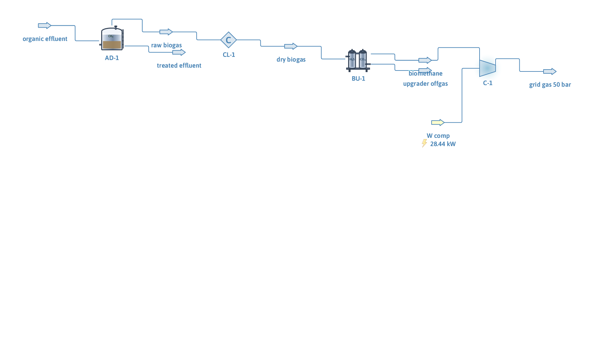

# Biogas-to-grid: anaerobic digestion and upgrading

**Category:** bioprocesses
**Status:** community
**DWSIM version:** 10.2.9
**Language:** English
**Contributor:** Daniel Wagner Oliveira de Medeiros (@DanWBR)

## Summary

A biogas valorization train built on DWSIM's free bioprocess unit operations: an organic effluent is digested anaerobically (Buswell black-box model, sulfate reduction to H2S included), the raw biogas (66.7 mol% CH4) is cooled, upgraded in an amine unit that removes 99 % of the CO2 and 99.5 % of the H2S, and the biomethane (98.7 wt% CH4) is compressed to 50 bar for grid injection.

## Process description

2 kg/s of effluent carrying 5 wt% glucose (as the COD surrogate) at 35 °C feeds an anaerobic digester: 1500 m³, HRT 20 days, 80 % COD removal, methane fraction 0.65, running the Buswell black-box model. The influent carries 600 mg/L of sulfate-sulfur, which the digester reduces to sulfide and partially strips into the biogas as H2S. The black-box digester reports its biogas dry, so the cooler only brings the gas down to 10 °C for the upgrader and nothing condenses. An amine upgrader then removes CO2 and H2S, and the biomethane is compressed to 50 bar.

## Feed and operating conditions

| Item | Value | Unit | Notes |
|---|---|---|---|
| Effluent | 2.0 | kg/s | 5 wt% glucose in water, 308 K |
| Digester | 1500 m³, HRT 20 d | | BlackBox (Buswell), isothermal |
| COD removal / CH4 fraction | 80 % / 0.65 | | |
| Influent sulfate-S | 600 | mg/L | reduced to H2S |
| Upgrader | amine | | CO2 99 %, H2S 99.5 %, H2O 90 % removal |
| Grid compression | 50 | bar | adiabatic, η = 75 % |

## Thermodynamics

- **Property package:** Peng-Robinson
- **Why this package:** the gas path (CH4/CO2/H2S at up to 50 bar) dominates; the digester's black-box stoichiometry does not depend on the activity model.

## Tuning and convergence notes

- The digester's compound roles must be assigned explicitly (`SubstrateCompound`, `MethaneCompound`, `CO2Compound`, `WaterCompound`, `NH3Compound`, `H2SCompound`). **Both ends of the sulfur path need `H2SCompound` set** — on the digester so the H2S is written into the biogas, and on the upgrader so its removal actually strips it; leave either unassigned and the sulfur is silently kept out of the streams.
- Feed compounds not present must be zeroed explicitly; a stray H2S in the feed would be indistinguishable from the H2S the digester makes.
- **The methane fraction override does not conserve COD.** It sets the CH4/CO2 split of the Buswell products on a carbon basis and leaves the rest of the stoichiometry alone. Glucose converts to 50 mol% CH4 by Buswell, so forcing 0.65 creates methane the substrate cannot supply: the methane carries 0.096 kg COD/s against 0.085 kg COD/s removed, a yield of 0.394 Nm³ CH4/kg COD removed against the theoretical 0.35. Read the case as a demonstration of the flowsheet and leave the override at 0 (the Buswell split) when the methane yield matters.
- Judge the upgrader's H2S performance on removed mass, not residual fraction: stripping the CO2 shrinks the gas ~2.5×, which concentrates whatever H2S survives and makes a fraction-based check look like a leak.

## Results

| Quantity | DWSIM | Notes |
|---|---|---|
| Raw biogas | 0.0566 kg/s | 66.7 mol% CH4, dry |
| H2S in raw biogas | 1.9 wt% | from 600 mg/L sulfate-S |
| Biomethane CH4 | 98.7 wt% | |
| Residual CO2 | 1.3 wt% | |
| H2S removal | 99.5 % | on mass basis |
| Grid delivery | 50 bar, 28.4 kW | |
| Methane yield | 0.394 Nm³/kg COD removed | above the 0.35 theoretical, see the override note |

## Files

- `biogas-to-grid.dwxmz` — the DWSIM flowsheet.
- `biogas-to-grid.png` — PFD screenshot.

This case is generated and verified by an automated test in the DWSIM repository (`tests/DWSIM.FluentAPI.Tests/Samples/BiogasToGridSample.cs`): built through the fluent API, solved, checked for the results above, saved, then reloaded and re-solved from the saved file.

## Confidentiality

All conditions are literature-typical values; no plant data was used.

## References

- Buswell, A. M., Mueller, H. F., "Mechanism of Methane Fermentation", *Ind. Eng. Chem.*, 1952 — the black-box stoichiometry.
