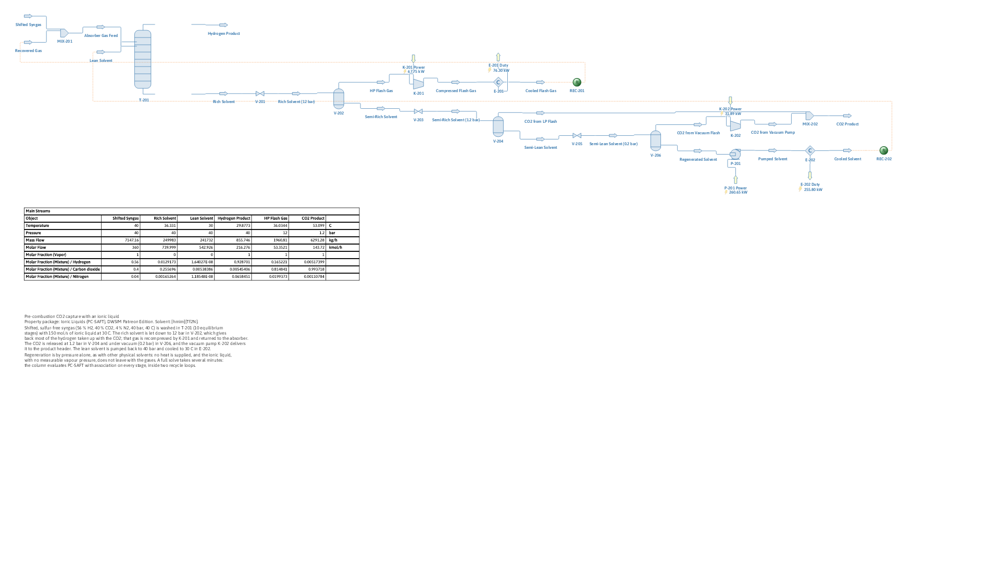

# Pre-combustion CO2 capture with an ionic liquid

**Category:** carbon-capture
**Status:** community
**DWSIM version:** 10.2.11 or later
**Language:** English
**Contributor:** Daniel Wagner Oliveira de Medeiros (@DanWBR)

> **Requirement.** The Ionic Liquids (PC-SAFT) property package belongs to DWSIM Patreon. The file opens anywhere, but it only solves where the package is licensed.

## Summary

Shifted, sulfur-free syngas from a gasification plant (56 % H2, 40 % CO2, 4 % N2 at 40 bar) is washed with the ionic liquid [hmim][Tf2N] (1-hexyl-3-methylimidazolium bis(trifluoromethylsulfonyl)imide), a physical solvent like Selexol or Rectisol methanol. The solvent is regenerated by pressure alone: a flash at 12 bar gives back the hydrogen taken up with the CO2, which is recompressed and returned to the absorber, and flashes at 1.2 bar and under vacuum release the CO2. Both loops (flash gas and solvent) are closed with recycle blocks. The absorber takes 99.2 % of the CO2 out of the syngas, and 99.6 % of the hydrogen leaves in the product gas.

## Process description

The syngas, joined by the recompressed flash gas, enters the bottom of the absorber T-201 (10 equilibrium stages, 40 bar) and meets 150 mol/s (about 67 kg/s) of lean ionic liquid at 30 °C fed at the top. The ionic liquid dissolves CO2 far better than H2 and N2, so the gas leaving the top is the hydrogen product.

The rich solvent is let down to 12 bar (V-201) and flashed in V-202. This releases most of the hydrogen and nitrogen that dissolved with the CO2, together with some CO2. That gas is recompressed to 40 bar (K-201), cooled to 40 °C (E-201) and sent back to the absorber through REC-201, so the hydrogen is not lost to the CO2 product.

The semi-rich solvent is let down to 1.2 bar (V-203) and flashed in V-204, then to 0.2 bar (V-205) and flashed in V-206. The vacuum pump K-202 takes the vacuum flash gas back to 1.2 bar, and both CO2 streams join in MIX-202 as the CO2 product. The regenerated solvent is pumped to 40 bar (P-201), cooled to 30 °C (E-202) and returned to the absorber through REC-202.

No heat is supplied anywhere. The solvent warms by about 6 K in the absorber (heat of absorption) and gives most of it back as it desorbs; the pump work is the rest of what E-202 removes.

## Feed and operating conditions

| Item | Value | Unit | Notes |
|---|---|---|---|
| Syngas flow | 100 | mol/s | 360 kmol/h, 7.15 t/h |
| Syngas composition | H2 56 / CO2 40 / N2 4 | mol % | after the water-gas shift and sulfur removal; CO left out (see below) |
| Syngas conditions | 40 °C, 40 bar | | |
| Solvent | [hmim][Tf2N], 150 | mol/s | about 67 kg/s, lean at 30 °C |
| Absorber T-201 | 10 stages, 40 bar | | no pressure drop |
| Hydrogen recovery flash V-202 | 12 | bar | gas recompressed to 40 bar, η = 75 % |
| CO2 flashes V-204 / V-206 | 1.2 / 0.2 | bar | vacuum pump η = 70 % |
| Solvent pump P-201 | 0.2 → 40 | bar | η = 75 % |

## Thermodynamics

- **Property package:** Ionic Liquids (PC-SAFT), DWSIM Patreon.
- **Why this package:** an ionic liquid has no measurable vapour pressure, a molar mass of 447 g/mol and dissolves CO2 physically. PC-SAFT describes the liquid density and the gas solubilities of such large, non-volatile molecules with few parameters, and the package keeps the solvent in the liquid at every pressure of the flowsheet.
- **Parameters:** the pure-compound parameters of [hmim][Tf2N] and the binary interaction parameters with CO2, H2 and N2 were fitted to data from NIST ILThermo (densities, and gas solubilities over temperature and pressure). For this ionic liquid all three gases have pairs fitted to measured solubilities, with a temperature-dependent kij.
- **What is left out:** a real syngas also carries 1 to 2 % CO, some CH4 and Ar, water and traces of H2S. The package has no fitted CO/ionic liquid pair, so CO is not included; it would behave much like N2. The water and H2S that real syngas carries would also dissolve in the ionic liquid, and are left out of this case.

## Tuning and convergence notes

- **Use the sum-rates method in the absorber.** The absorption column defaults to the Naphtali-Sandholm solver, which builds a full Jacobian by finite differences of PC-SAFT on every stage. With the Burningham-Otto (Sum Rates) method the absorber converges in about 11 iterations and 4 s, against 31 iterations and about 60 s with Naphtali-Sandholm, to the same products.
- **Start both recycles from a complete state.** The tear streams (Recovered Gas, Lean Solvent) carry temperature, pressure, flow and composition close to the answer. Lean Solvent starts as 150 mol/s of ionic liquid with 1 mol/s of CO2; Recovered Gas as 2 mol/s H2, 4 mol/s CO2 and 0.2 mol/s N2.
- The whole flowsheet solves in about 3 minutes from those estimates and in under 2 minutes when re-solved from the saved file: the column runs PC-SAFT with association (the ionic liquid is modelled as an associating ion pair) on every stage, inside two loops.
- The 12 bar flash is a compromise. A lower pressure gives back more hydrogen but also more CO2, which then circulates through K-201 and the absorber; at 12 bar the recycle gas is 82 % CO2 and K-201 needs 68 kW.

## Results

| Quantity | DWSIM | Notes |
|---|---|---|
| Recycles | converged | both loops |
| CO2 captured | 99.2 % | of the CO2 in the syngas |
| H2 recovered | 99.63 % | to the hydrogen product |
| Hydrogen product | 92.87 mol % H2, 0.55 % CO2, 6.58 % N2 | 40 bar |
| CO2 product | 99.37 mol % CO2, 0.52 % H2 | 1.2 bar |
| Rich / lean solvent CO2 | 0.2557 / 0.0054 | mole fraction |
| Absorber bottom temperature | 36.3 °C | heat of absorption |
| Recycled flash gas | 14.8 mol/s, 16.5 mol % H2 | |
| K-201 (flash gas compressor) | 67.8 kW | |
| K-202 (vacuum pump) | 31.9 kW | |
| P-201 (solvent pump) | 260.6 kW | the largest power demand |
| E-202 (solvent cooler) | 255.8 kW | |
| Balances | CO2 8e-4, H2 7e-5, N2 1e-5 mol/s | on 40, 56 and 4 mol/s in |
| Ionic liquid in the gases | 6e-12 mol/s | no make-up needed |

The solvent pump dominates the power: a physical solvent needs a large circulation, and the whole of it is pumped from vacuum to 40 bar. That is the price of regenerating without heat, and the reason physical solvents pay off at high CO2 partial pressures such as this one (16 bar).

## Files

- `ionic-liquid-precombustion-capture.dwxmz`: the DWSIM flowsheet.
- `ionic-liquid-precombustion-capture.png`: PFD screenshot.

This case is generated by an automated test (`IonicLiquidPrecombustionTest`) in the DWSIM Patreon repository: the flowsheet is built through the fluent API, solved, checked for the balances above, saved, then reloaded and re-solved from the saved file.

## Confidentiality

All conditions are textbook values chosen for the case; no plant data was used.

## References

- Kohl, A. L., Nielsen, R. B., *Gas Purification*, 5th ed., Gulf Publishing, 1997: physical solvent processes and pre-combustion CO2 removal.
- Ramdin, M., de Loos, T. W., Vlugt, T. J. H., State-of-the-art of CO2 capture with ionic liquids, *Ind. Eng. Chem. Res.* 51 (2012) 8149-8177.
- NIST ILThermo (Ionic Liquids Database), https://ilthermo.boulder.nist.gov: the data the package parameters were fitted to.
