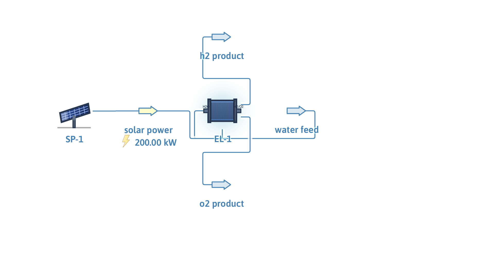

# Green hydrogen: solar-powered water electrolysis

**Category:** clean-energy
**Status:** community
**DWSIM version:** 10.2.0
**Language:** English
**Contributor:** Daniel Wagner Oliveira de Medeiros (@DanWBR)

## Summary

A minimal green-hydrogen production unit: a 100-panel solar array (10 m² each, 20 % efficiency, 1 kW/m² irradiation → 200 kW) powers a 100-cell water electrolyzer at 180 V. Hydrogen production lands exactly on Faraday's law — 0.576 mol/s (4.2 kg/h) of H2 at 99.4 mol% purity, a specific consumption of ~48 kWh/kg.

## Process description

The solar panel block generates 200 kW of electric power on its energy port, which feeds the electrolyzer's energy input. The electrolyzer takes water at 25 °C and 5 bar and produces a hydrogen-rich stream on port 0 and an oxygen-rich stream on port 1; the unreacted water leaves with the oxygen side.

## Feed and operating conditions

| Item | Value | Unit | Notes |
|---|---|---|---|
| Solar array | 100 × 10 m², 20 % | | 1 kW/m² irradiation |
| Electrolyzer | 180 V, 100 cells | | |
| Water feed | 1.0 | kg/s | 298.15 K, 5 bar |

## Thermodynamics

- **Property package:** Steam Tables (IAPWS-IF97)
- **Why this package:** the balance is dominated by water; H2 and O2 appear as product gases whose split the unit computes internally.

## Tuning and convergence notes

- Both clean-energy units create their ports only when `CreateConnectors()` is called on the unit operation; connect streams after that.
- **Zero the unset compounds in the water feed.** Compounds you do not set do not default to zero: with only `Water = 1 kg/s` assigned, the feed silently carried phantom H2 and O2 and every product flow came out hundreds of times too large. With H2 and O2 explicitly zeroed, the production lands exactly on Faraday's law.
- The solar power (area × count × efficiency × irradiation = 200 kW) caps the electrolyzer throughput; increase the panel count or area to drive more water conversion.

## Results

| Quantity | DWSIM | Reference | Rel. error |
|---|---|---|---|
| Solar power | 200 kW | 100 × 10 m² × 20 % × 1 kW/m² | 0 |
| H2 production | 0.5758 mol/s (4.18 kg/h) | Faraday: P/V × cells / 2F = 0.5758 mol/s | < 0.01 % |
| O2 production | 0.2879 mol/s | half the H2 rate | < 0.01 % |
| H2 purity | 99.4 mol% | water-saturated at 5 bar | — |
| Specific consumption | ~48 kWh/kg H2 | modern electrolyzers: 45–55 | consistent |

## Files

- `green-hydrogen-solar-electrolysis.dwxmz` — the DWSIM flowsheet.
- `green-hydrogen-solar-electrolysis.png` — PFD screenshot.

This case is generated and verified by an automated test in the DWSIM repository (`tests/DWSIM.FluentAPI.Tests/Samples/GreenHydrogenSample.cs`): built through the fluent API, solved, checked for the results above, saved, then reloaded and re-solved from the saved file.

## Confidentiality

All conditions are invented, physically plausible values; no plant data was used.

## References

- Ursúa, Gandía, Sanchis, "Hydrogen Production From Water Electrolysis", *Proc. IEEE*, 2012.
