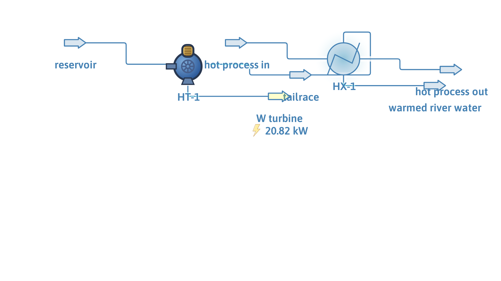

# Hydroelectric turbine with heat recovery

**Category:** clean-energy
**Status:** community
**DWSIM version:** 10.2.0
**Language:** English
**Contributor:** Daniel Wagner Oliveira de Medeiros (@DanWBR)

## Summary

A small run-of-river hydroelectric turbine (50 kg/s, 50 m head, 85 % efficiency → 20.8 kW) whose tailrace water then serves as the cold sink of a UA-rated heat exchanger cooling a hot process stream — a compact example of pairing DWSIM's clean-energy units with conventional heat integration.

## Process description

Reservoir water at 15 °C and 6 bar drives a hydroelectric turbine with 50 m of static head and 85 % efficiency, generating electric power on its energy port. The tailrace water then passes through the cold side of a heat exchanger (UA = 15000 W/K) against 5 kg/s of hot process water at 80 °C, recovering heat that would otherwise need cooling utility.

## Feed and operating conditions

| Item | Value | Unit | Notes |
|---|---|---|---|
| River water | 50 | kg/s | 288.15 K, 6 bar |
| Static head | 50 | m | inlet/outlet velocity 3 m/s |
| Turbine efficiency | 85 | % | |
| Hot process water | 5 kg/s | | 353.15 K |
| Exchanger | UA = 15000 | W/K | CalcBothTemp_UA mode |

## Thermodynamics

- **Property package:** Steam Tables (IAPWS-IF97)
- **Why this package:** pure water on both sides; the steam tables are exact for this service.

## Tuning and convergence notes

- The turbine's electric output sits on output connector 1, which does not exist until the unit's `CreateConnectors()` is called; the energy stream is then attached to that port.
- Sanity anchor: ṁ·g·h·η = 50 × 9.81 × 50 × 0.85 ≈ 20.8 kW, which is what the unit reports.

## Results

| Quantity | DWSIM | Notes |
|---|---|---|
| Turbine power | 20.83 kW | matches ṁ·g·h·η |
| Hot side | 353.1 → 320.5 K | |
| Cold side | 288.2 → 291.3 K | 50 kg/s warms 3.2 K |
| Cold-side mass balance | 50.00 kg/s | conserved |

## Files

- `hydroelectric-heat-recovery.dwxmz` — the DWSIM flowsheet.
- `hydroelectric-heat-recovery.png` — PFD screenshot.

This case is generated and verified by an automated test in the DWSIM repository (`tests/DWSIM.FluentAPI.Tests/Samples/HydroelectricSample.cs`): built through the fluent API, solved, checked for the results above, saved, then reloaded and re-solved from the saved file.

## Confidentiality

All conditions are invented, physically plausible values; no plant data was used.

## References

- Any hydropower text: P = ρ·Q·g·H·η.
