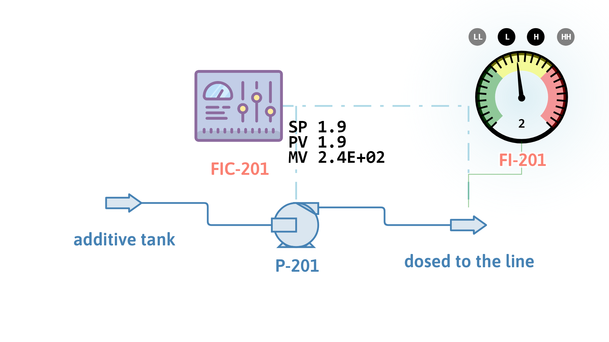

# Metering pump under flow control (dynamic)

**Category:** fluid-flow-and-piping
**Status:** community
**DWSIM version:** 10.2.9 or later (the positive displacement calculation mode needs a build newer than 10.2.9)
**Language:** English
**Contributor:** Daniel Wagner Oliveira de Medeiros (@DanWBR)

## Summary

A dosing pump delivering an additive into a process line, with a flow controller on its drive. The pump runs in Positive Displacement mode: it delivers the volume it sweeps every revolution, so the only way to change the rate is to change the speed. The case is set up for dynamics, with an event that raises the dosing rate from 1.894 to 2.6 kg/s at t = 60 s; the controller finds the new speed, 329.4 rpm, and the delivered rate follows the speed exactly.

This is the counterpart to the centrifugal cases: there the machine sets the head and the system decides the flow, here the machine sets the flow and the system decides the pressure.

## Process description

The additive leaves its tank at 25 °C and 2 bar and is pumped into a line held at 12 bar. P-201 displaces 0.5 litre per revolution at 95 % volumetric efficiency, runs at 240 rpm and carries a relief setting of 25 bar. FIC-201 reads the mass flow of the dosed stream and writes the pump's target speed; FI-201 shows the same rate on a 0-4 kg/s gauge with low and high alarms at 1.2 and 3.2 kg/s.

## Feed and operating conditions

| Item | Value | Unit | Notes |
|---|---|---|---|
| Additive | water | | 298.15 K, 2 bar at the suction |
| Displacement | 0.0005 | m³/rev | 0.5 litre per revolution |
| Volumetric efficiency | 95 | % | slip past the valves and the plunger |
| Starting speed | 240 | rpm | 4 revolutions per second |
| Discharge pressure | 12 | bar | set by the line the additive goes into |
| Relief setting | 25 | bar | the discharge is limited to this |
| Pump efficiency | 90 | % | for the shaft power |
| Motor inertia / torque | 0.8 / 2.0 | kg·m² / N·m | sets how fast the drive can change speed |

## Control and the dynamic run

| Item | Value | Notes |
|---|---|---|
| FIC-201 process variable | mass flow of `dosed to the line` | kg/s |
| FIC-201 manipulated variable | P-201 target speed | rpm |
| Tuning | Kp 0.25, Ki 0.06, Kd 0 | direct acting |
| Output limits / span / bias | 60-600 rpm / 540 rpm / 240 rpm | |
| Integration step / duration | 1 s / 180 s | |
| Event | setpoint to 2.6 kg/s at t = 60 s | the operator raising the dose |

The tuning is worth a word, because the controller works on a normalized error, `(PV - SP)/SP`, and turns its output into a speed through the span: `speed = bias - output x span`. The loop gain is therefore `Kp x span x (flow per rpm) / setpoint`, which here is about 0.4 at Kp = 0.25. Take Kp up to 0.8 and the gain passes one, and the loop breaks into a two-step limit cycle between 317 and 341 rpm: the flow overshoots on every correction and the next correction is larger than the error it is fixing.

## Thermodynamics

- **Property package:** Steam Tables (IAPWS-IF97)
- **Why this package:** the additive is modelled as water at ambient temperature, where the steam tables give the density the displacement-to-mass-flow conversion needs.

## How to run it

1. Open the case and solve it. The pump delivers 1.894 kg/s at 240 rpm, and FIC-201 sits at that setpoint with zero error.
2. Switch to Dynamic Mode and run the `Dosing run` schedule. The event raises the setpoint at t = 60 s.
3. Watch the two monitored variables: the dosing rate and the pump speed.

## Results

| Quantity | DWSIM | Notes |
|---|---|---|
| Delivered rate at 240 rpm | 1.894 kg/s | 0.0005 m³/rev x 4 rev/s x 0.95 x 997 kg/m³ |
| Delivered rate at the end | 2.600 kg/s | the new setpoint, reached with no offset |
| Speed at the end | 329.4 rpm | found by the controller |
| Flow ratio / speed ratio | 1.3724 / 1.3724 | equal to five decimal places |
| Shaft power at 240 rpm | 2.111 kW | q x ΔP / η |
| Shaft power at 329.4 rpm | 2.897 kW | the pressure did not change, the flow did |
| Temperature rise | 0.045 K | pumping work into a liquid |

The rate is within 1 % of the new setpoint about 35 s after the step and settles by 90 s. Most of that is the drive: the motor's inertia and torque limit how fast the speed can move, and the flow follows the speed with no lag of its own.

## Notes on the model

- A positive displacement pump ignores the flow of its feed stream: it delivers what it displaces, and the flowsheet log warns when the two disagree. In a real installation that difference is what the suction accumulator or the relief valve absorbs.
- The discharge pressure comes from the line, not from the pump, and is clamped at the relief setting. A dosing pump against a blocked discharge is a pressure problem, which is what the relief setting represents here.
- The affinity laws do not apply to this machine. There is no head curve to scale: the flow is linear in speed and the pressure is whatever the system imposes.

## Files

- `dosing-pump-flow-control-dynamics.dwxmz` - the DWSIM flowsheet, with the integrator, the event and the schedule already configured.
- `dosing-pump-flow-control-dynamics.png` - the PFD above.
