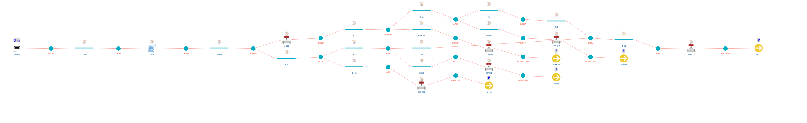

# Fire water ring of an LPG bulk plant (steady state and dynamic)

**Category:** fluid-flow-and-piping
**Status:** community
**DWSIM version:** 10.2.9 or later
**Language:** English
**Contributor:** Daniel Wagner Oliveira de Medeiros (@DanWBR)

> **Requirement.** The Pipe Network unit operation belongs to DWSIM Patreon, and running a network in dynamic mode needs level 2 or above. The file opens anywhere, but the network only solves where the extension is licensed.

## Summary

The fire protection ring of a bulk LPG distribution plant: a 278 m³ reservoir, one electric fire pump on its manufacturer's curve, a 6 in primary ring carrying the tank spray ring and the monitor, and a 4 in secondary ring carrying three hydrants, both leaving the same pump house and closing on each other, so every consumer is fed from two sides. The four design conditions of the source project are reproduced in steady state, and a fire is then run in dynamic mode, where the consumers are opened one after another by scheduled events while the pump answers with its curve.

The point of the dynamic run is the last event. Hydrant, spray ring and monitor together ask for about 280 m³/h, which is the figure NBR 15186 sizes the *reservoir* for, and roughly 70 % more than this pump delivers at any useful pressure: the ring falls from 6.4 to 3.2 kgf/cm², below the 4 kgf/cm² the standard requires, and every consumer loses flow at once. Sizing the pump for the worst single scenario and the tank for the sum is a decision this case lets you watch.

## Where the numbers come from

Geometry, equivalent lengths, required flows and the pump curve are taken from a published final-year design project: *Projeto de sistema de combate a incêndio de uma planta de distribuição de gás liquefeito de petróleo a granel*, D. N. C. da Costa, D. J. P. de S. Mota and G. B. Matos, CEFET/RJ, 2017. That project sized the system by hand, one critical path at a time, with Hazen-Williams losses and equivalent lengths for the fittings, and intersected the resulting installation curve with the pump curve. This case puts the same plant into a network that solves every path simultaneously.

## The plant

| Item | Value | Notes |
|---|---|---|
| Reservoir | 278.4 m³, 3 m of water | the one-hour requirement of NBR 15186 |
| Fire pump BI-01 | KSB Meganorm 80-400, 330 mm impeller | head curve 74.4 m at shut-off to 52 m at 225 m³/h |
| Suction line | 30.4 m equivalent, 6 in | |
| Pump house discharge | 32.7 m equivalent, 6 in | |
| Primary ring (6 in) | 81 m to the monitor, 103 m to the spray, 130 m to the far corner | |
| Secondary ring (4 in) | 63 / 108 / 150 m to H-1, H-2 and H-3 | closes on the primary |
| Pipe | galvanized steel, Hazen-Williams C = 120 | the coefficient the project used |
| Sectioning valve V-101 | on the primary, downstream of the header | shut for condition 3 |

Consumers are modelled as a branch line, a flow coefficient and a discharge to atmosphere. The coefficient is the same square law an orifice obeys, `dP = 1 bar x (Q/Kv)²` with Q in m³/h, so one number stands for the whole assembly: for a hydrant, two 2½ in outlets with 15 m of hose and a nozzle on each.

| Consumer | Kv open | Rated flow (NBR 15186) | Branch |
|---|---|---|---|
| Tank spray ring, P-60000 | 43 | 98.4 m³/h | 41.4 m of 4 in, 4 m up |
| Monitor C-1 (CMF-1250-4) | 107 | 120 m³/h minimum, 4730 L/min maximum | 14 m of 4 in, 2 m up |
| Hydrants H-1, H-2, H-3 | 25 each | 60 m³/h | 25.7 m of 4 in, 2 m up |
| Any of them shut | 0.01 | about 0.1 m³/h leaks past | |

## Thermodynamics

- **Property package:** Steam Tables (IAPWS-IF97)
- **Why this package:** cold fresh water; the incompressible nodal solver needs one density and the steam tables give it exactly.

## The four design conditions

Each condition is a set of consumers opened; the network finds the flows and the pressures.

| Condition | DWSIM: pump | DWSIM: consumer | Source project |
|---|---|---|---|
| 1. Tank spray + hydrant H-2 | 161.3 m³/h at 65.3 m | spray 100.3 and hydrant 60.9 m³/h, ring at 6.4 kgf/cm² | 160 m³/h at 65.6 m |
| 2. The most distant hydrant H-3 | 66.5 m³/h at 73.9 m | 66.4 m³/h, ring at 7.5 kgf/cm² | requirement 60 m³/h |
| 3. H-3 with the primary ring isolated | 64.0 m³/h at 73.9 m | 63.8 m³/h, ring at 7.0 kgf/cm² | requirement 60 m³/h |
| 4. The monitor alone | 214.5 m³/h at 54.1 m | 214.4 m³/h, ring at 5.0 kgf/cm² | 215 m³/h at 54 m |

Conditions 1 and 4 are the two the project computed a duty point for, and the network lands on both within half a percent of head. Conditions 2 and 3 are the same hydrant reached by the two sides of the ring: isolating the 6 in primary costs 2.5 m³/h and half a kgf/cm² at the nozzle, which is the margin a ring buys you.

## The fire, in dynamic mode

The schedule `Fire` runs 750 s at 5 s steps, with four events:

| t | Event |
|---|---|
| 60 s | the brigade opens hydrant H-2 |
| 180 s | the deluge valve of the P-60000 spray ring opens |
| 360 s | the monitor is opened on top of both |
| 600 s | the monitor is shut again |

| t [s] | Ring at H-2 [kgf/cm²] | Pump [m³/h] | H-2 | Spray | Monitor [m³/h] |
|---|---|---|---|---|---|
| 0 | 7.82 | 0 | 0 | 0 | 0 |
| 90 | 7.53 | 66.5 | 66.4 | 0 | 0 |
| 210 | 6.37 | 161.3 | 60.9 | 100.3 | 0 |
| 390 | **3.24** | 280.0 | 42.8 | 67.9 | 169.4 |
| 630 | 6.37 | 161.3 | 60.9 | 100.3 | 0 |

Standby is a real operating point: with everything shut the pump churns at its shut-off head and the ring sits at 7.8 kgf/cm², which is what the jockey pump of the real installation holds. The case is saved in that state, so running the schedule tells the whole story from the beginning.

## Notes on the model

- The network is quasi-steady: it re-solves the whole ring at every integration step, with the pump on its curve and the boundaries where the events put them. There is no surge and no line pack, which is the right level for anything driven by valves and controls, and the wrong one for a water hammer study.
- The pump's head curve is entered as the project tabulated it, from shut-off to 225 m³/h. In the overload the network reads past the end of the table, where the curve continues along the slope of its last segment.
- The efficiency curve carries the manufacturer's values from 50 to 175 m³/h, extended to 225 m³/h so the monitor condition has something to read.
- Elevations are carried by the branch lines: the ring is buried, the hydrants and the monitor discharge 2 m above it, the tank spray ring 4 m above it.
- Equivalent lengths already include the fittings, exactly as the source project tabulated them, so no separate fitting count appears in the network.

## Files

- `fire-water-ring-network.dwxmz` - the DWSIM flowsheet, with the network, the integrator, the events and the schedule.
- `fire-water-ring-network.png` - the network diagram above.
