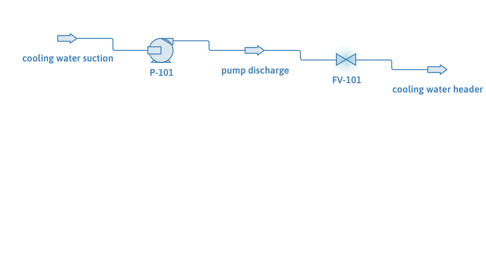

# Cooling water pump on a variable-frequency drive

**Category:** fluid-flow-and-piping
**Status:** community
**DWSIM version:** 10.2.9 or later (the curve sets of a second speed need a build newer than 10.2.9)
**Language:** English
**Contributor:** Daniel Wagner Oliveira de Medeiros (@DanWBR)

## Summary

A cooling water transfer pump that carries the manufacturer's curves at two speeds, 1450 and 1750 rpm, and runs at 1600 rpm on its drive. DWSIM reads the operating point off both measured sets and interpolates between them, giving 62.8 m of head and 69.7 % efficiency at 20 kg/s, against 49.9 m at 1450 rpm and 75.8 m at 1750 rpm. This is the case to look at before entering a variable-frequency dataset of your own.

## Process description

20 kg/s of cooling water at 30 °C leaves the basin at atmospheric pressure and is pumped into a header held at 4 bar by the discharge control valve. The pump P-101 runs in Performance Curves mode with head, efficiency and NPSHr curves for each measured speed; FV-101 takes the rest of the discharge pressure down to the header.

## Feed and operating conditions

| Item | Value | Unit | Notes |
|---|---|---|---|
| Cooling water | 20 | kg/s | 303.15 K, 1 atm at the suction |
| Pump speed | 1600 | rpm | between the two measured sets |
| Measured speeds | 1450 and 1750 | rpm | impeller 250 mm |
| Header pressure | 400 | kPa | set by FV-101 |

The curves, as they are entered in the editor:

| Q (m³/s) | Head at 1450 rpm (m) | Efficiency (%) | NPSHr (m) |
|---|---|---|---|
| 0.000 | 60.0 | 10.0 | 1.0 |
| 0.010 | 57.0 | 55.0 | 1.5 |
| 0.020 | 50.0 | 70.0 | 2.2 |
| 0.030 | 38.0 | 68.0 | 3.2 |
| 0.040 | 20.0 | 50.0 | 4.5 |

| Q (m³/s) | Head at 1750 rpm (m) | Efficiency (%) | NPSHr (m) |
|---|---|---|---|
| 0.000 | 87.0 | 10.0 | 1.4 |
| 0.012 | 82.0 | 56.0 | 2.1 |
| 0.024 | 72.0 | 71.0 | 3.1 |
| 0.036 | 55.0 | 67.0 | 4.6 |
| 0.048 | 29.0 | 47.0 | 6.4 |

The 1750 rpm set is deliberately below the affinity parabola of the 1450 rpm set at the top of the range, and its best efficiency sits at a slightly different flow, which is what a real machine does and what makes a measured second set worth entering.

## Thermodynamics

- **Property package:** Steam Tables (IAPWS-IF97)
- **Why this package:** pure water well below its boiling point; the steam tables are exact here and give the density the head-to-pressure conversion needs.

## Tuning and convergence notes

- With a single curve set, the pump covers other speeds with the affinity laws: the point is read at the flow divided by the speed ratio, head and NPSHr are scaled by the square of the ratio and power by its cube, with efficiency invariant. That is the right approximation when only one curve is published.
- With sets at several speeds, the point is read off the two sets that bracket the running speed at the actual flow and blended linearly. At 1600 rpm, halfway between 1450 and 1750, the head is the average of the two readings, which is what the numbers below show.
- Outside the measured range the nearest set is scaled with the affinity laws and the flowsheet log records that the curves were extrapolated.
- The pump refuses to extrapolate along the flow axis: a flow rate past the end of a curve is an error, not a guess. If the case fails after you change the flow, that is the first thing to check.
- Only the head curve is mandatory. With the efficiency curve disabled the pump falls back to the efficiency typed in the editor, and with the power curve disabled the power follows from the head and the efficiency, which is what happens here.

## Results

| Quantity | DWSIM | Notes |
|---|---|---|
| Head at 1450 rpm | 49.92 m | the measured set, read at 0.0201 m³/s |
| Head at 1600 rpm | 62.84 m | the blend, halfway between the two sets |
| Head at 1750 rpm | 75.75 m | the second measured set |
| Efficiency at 1600 rpm | 69.68 % | read off the measured efficiency curves |
| Shaft power | 17.69 kW | W·g·H/η |
| Header pressure | 400.0 kPa | set by FV-101 |
| Mass balance | 20.00 kg/s | conserved |

Scaling the 1450 rpm set to 1750 rpm with the affinity laws would give 76.9 m instead of the measured 75.8 m, and a different efficiency; the gap is the reason to enter the second set.

## Files

- `pump-variable-frequency-drive.dwxmz` - the DWSIM flowsheet.
- `pump-variable-frequency-drive.png` - the PFD above.
