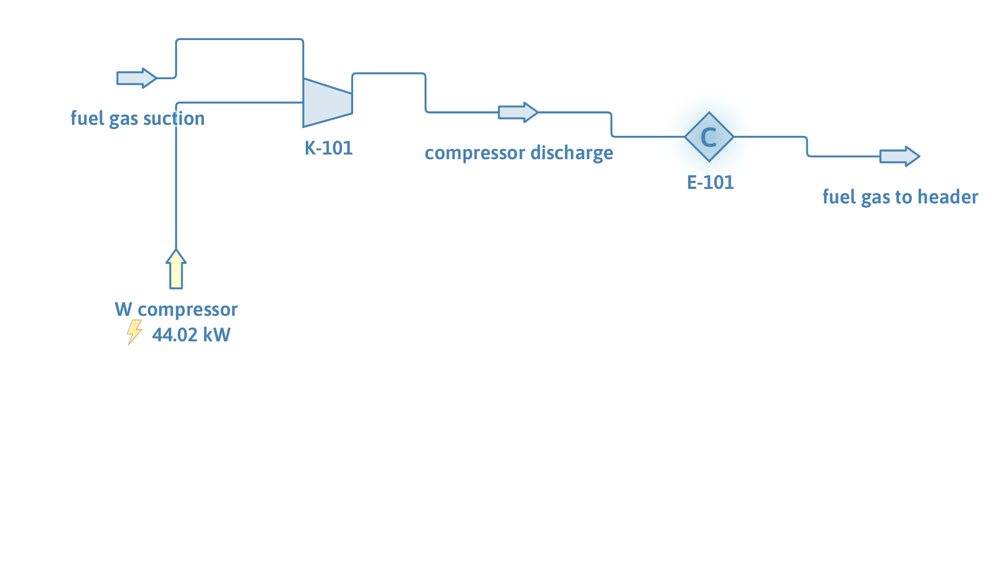

# Fuel gas booster compressor on its performance map

**Category:** gas-processing
**Status:** community
**DWSIM version:** 10.2.9 or later
**Language:** English
**Contributor:** Daniel Wagner Oliveira de Medeiros (@DanWBR)

## Summary

A fuel gas booster described by the map its maker measured: head and efficiency against inlet actual flow at 8000, 10000 and 12000 rpm. The machine runs at 11000 rpm, between two measured speeds, and DWSIM interpolates the map to 4629 m of head, a 1.35 pressure ratio and 44.0 kW of shaft power, with an aftercooler taking the discharge back to 40 °C.

## Process description

0.6 kg/s of fuel gas (90 wt% methane, 7 % ethane, 3 % nitrogen) arrives at 2 bar and 25 °C. K-101 raises it to the header pressure on its performance map, and E-101 cools the discharge to 40 °C with a 0.2 bar drop. The shaft power leaves on the compressor's energy stream.

## Feed and operating conditions

| Item | Value | Unit | Notes |
|---|---|---|---|
| Fuel gas | 0.60 | kg/s | 298.15 K, 2 bar |
| Composition | 90 / 7 / 3 | wt% | methane / ethane / nitrogen |
| Running speed | 11000 | rpm | between the 10000 and 12000 rpm curves |
| Measured speeds | 8000, 10000, 12000 | rpm | head and efficiency each |
| Aftercooler outlet | 313.15 | K | 0.2 bar pressure drop |

The map, as entered in the curve editor (flow as actual m³/h at the inlet, head in metres of gas, efficiency in per cent):

| Speed (rpm) | Flow (m³/h) | Head (m) | Efficiency (%) |
|---|---|---|---|
| 8000 | 1000 / 2000 / 3000 / 4000 | 2500 / 2300 / 1900 / 1200 | 60 / 72 / 75 / 68 |
| 10000 | 1200 / 2400 / 3600 / 4800 | 3900 / 3600 / 3000 / 1900 | 61 / 73 / 76 / 69 |
| 12000 | 1400 / 2800 / 4200 / 5600 | 5600 / 5200 / 4300 / 2700 | 59 / 71 / 74 / 66 |

## Thermodynamics

- **Property package:** Peng-Robinson
- **Why this package:** a light hydrocarbon gas with nitrogen at a few bar; Peng-Robinson gives the density and the k = cp/cv that the adiabatic head-to-pressure relation uses, and its parameters for these components are well established.

## Tuning and convergence notes

- The x axis of a compressor curve is read as actual volumetric flow when its unit carries `@ P,T`, and as molar flow otherwise. Entering `m3/h` without the suffix silently changes the meaning of every point, and is the usual reason a map gives absurd results.
- Head has priority over power: if the head curve of a speed is enabled, the power curve of that speed is ignored. Leave one of the two enabled, not both, unless you mean to.
- A speed outside the range of the measured curves is extrapolated linearly by the interpolation between speeds, so keep the running speed inside the map.
- The head read off the map is a head of gas, not a pressure: 4629 m here is a pressure ratio of 1.35, because the gas density at the suction is about 1.4 kg/m³. Checking the ratio against `H·g = Z·R·T/M · k/(k-1) · [(P2/P1)^((k-1)/k) - 1]` is a good sanity test of a map before trusting it.
- The efficiency read at the operating point (about 62 % here, at the low-flow end of the curves) is what divides the hydraulic power, so the shaft power is above the ideal one.

## Results

| Quantity | DWSIM | Notes |
|---|---|---|
| Head at 10000 rpm | 3750 m | measured set |
| Head at 11000 rpm | 4629 m | interpolated between the two |
| Head at 12000 rpm | 5509 m | measured set |
| Discharge pressure | 269.6 kPa | ratio 1.35 from 200 kPa |
| Shaft power | 44.02 kW | at the efficiency read off the map |
| Aftercooler outlet | 313.15 K | at 249.6 kPa |
| Mass balance | 0.600 kg/s | conserved |

## Files

- `compressor-performance-map.dwxmz` - the DWSIM flowsheet.
- `compressor-performance-map.png` - the PFD above.
