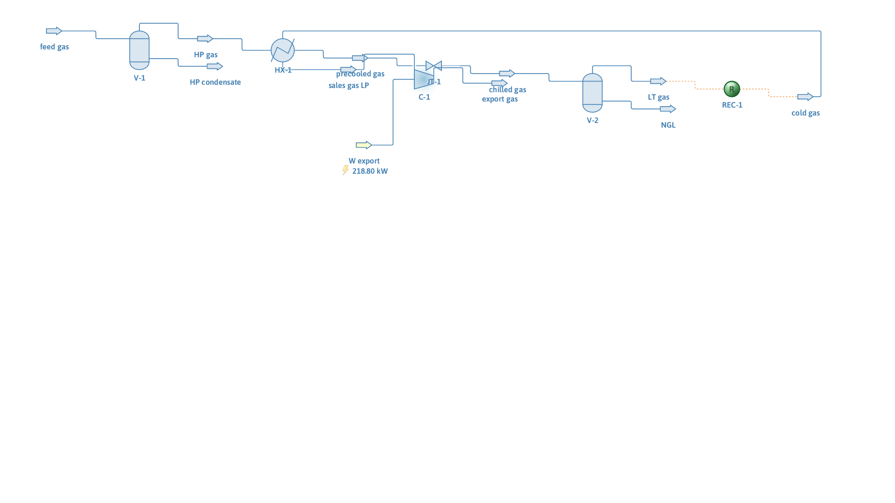

# Natural gas hydrocarbon dew-point control (JT self-refrigeration)

**Category:** gas-processing
**Status:** community
**DWSIM version:** 10.2.0
**Language:** English
**Contributor:** Daniel Wagner Oliveira de Medeiros (@DanWBR)

## Summary

A Joule-Thomson dew-point control unit for dehydrated natural gas: the feed pre-chills itself against the cold sales gas in a gas-gas exchanger, expands 60 → 30 bar across a JT valve, drops NGL in a cold separator at 250 K, and is recompressed to pipeline pressure. The loop between the cold separator and the exchanger is closed with a Recycle block and converges cleanly, cutting the sales-gas C5 content roughly in half.

## Process description

Feed gas (water-free, as delivered by an upstream TEG dehydration unit) enters an inlet knockout drum and flows through the hot side of a gas-gas exchanger, where the cold gas returning from the cold separator chills it to −5 °C. The precooled gas expands through a JT valve from 60 to 30 bar, dropping another 18 K by Joule-Thomson effect. The cold separator at ~250 K knocks out the condensed C3+ as NGL; the cold overhead returns through the exchanger's cold side (this is the recycle loop) and leaves as sales gas, which an export compressor takes back to 60 bar.

## Feed and operating conditions

| Item | Value | Unit | Notes |
|---|---|---|---|
| Feed flow | 100 | mol/s | 303.15 K, 60 bar |
| Feed composition (mol) | CH4 88 / C2 6.5 / C3 2.5 / nC4 1.0 / nC5 0.5 / N2 1.5 | % | dehydrated gas |
| Gas-gas exchanger hot outlet | 268.15 | K | specified; cold outlet computed |
| JT valve outlet | 30 | bar | isenthalpic |
| Export pressure | 60 | bar | adiabatic compressor, η = 75 % |

## Thermodynamics

- **Property package:** Peng-Robinson
- **Why this package:** the standard choice for light hydrocarbon gas processing at high pressure; no polar components remain after dehydration.
- **Interaction parameters / assays:** DWSIM defaults.

## Tuning and convergence notes

- The gas-gas exchanger creates a genuine recycle: its cold inlet is the cold separator's overhead, which depends on the exchanger's own hot outlet. The loop is closed with a Recycle block whose tear stream (the exchanger's cold inlet) carries a **complete initial state** — temperature, pressure, flow and composition close to the expected answer. A tear stream left empty makes the loop converge to zero flow.
- The exchanger runs in `CalcTempColdOut` mode: the hot outlet temperature is the specification and the cold outlet follows from the energy balance. Because the hot side is pinned by the spec, the recycle converges in a few iterations.
- The case was originally built with 1 % water in the feed to also show water knockout, but at 60 bar / 303 K the flash stability test misses the aqueous phase (with `ForceEquilibriumCalculationType = VLLE` the water-free streams fail instead), so the sales gas came out as wet as the feed. Modelling the unit downstream of dehydration, on a dry basis, matches how real JT plants are operated and keeps every flash robust.

## Results

| Quantity | DWSIM | Notes |
|---|---|---|
| Recycle | converged | |
| Global mass balance | closes to < 0.001 % | 1.8536 kg/s in = out |
| JT temperature drop | 18.3 K | 268.2 → 249.9 K |
| Cold separator temperature | 249.9 K | |
| Sales gas C5 | 0.24 mol% | 0.50 mol% in the feed |
| Sales gas nC4 | 0.79 mol% | 1.0 mol% in the feed |
| NGL recovered | 0.045 kg/s | |
| Export compressor power | 218.8 kW | |

## Files

- `natural-gas-dew-point-control.dwxmz` — the DWSIM flowsheet.
- `natural-gas-dew-point-control.png` — PFD screenshot.

This case is generated and verified by an automated test in the DWSIM repository (`tests/DWSIM.FluentAPI.Tests/Samples/NaturalGasProcessingSample.cs`): the flowsheet is built through the fluent API, solved, checked for the results above, saved, then reloaded and re-solved from the saved file.

## Confidentiality

All conditions are textbook-plausible values invented for the case; no plant data was used.

## References

- Campbell, J. M., *Gas Conditioning and Processing*, Vol. 2 — low-temperature separation / JT dew-point control units.
