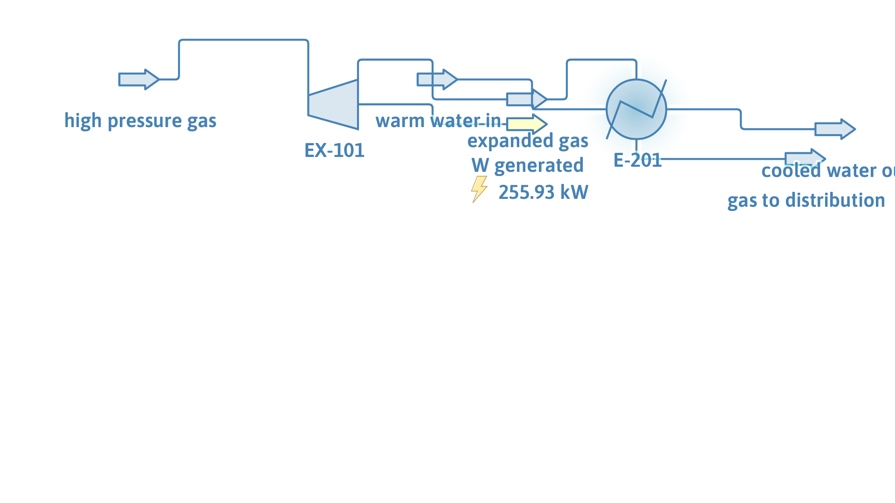

# Letdown turboexpander on its measured power map

**Category:** gas-processing
**Status:** community
**DWSIM version:** newer than 10.2.9 (the expander produced no duty in Performance Curves mode up to 10.2.9)
**Language:** English
**Contributor:** Daniel Wagner Oliveira de Medeiros (@DanWBR)

## Summary

A city-gate letdown turboexpander described by the power its maker measured at 14000, 18000 and 22000 rpm against inlet actual flow. Running at 20000 rpm it generates 255.9 kW while dropping 2 kg/s of gas from 40 to 9.3 bar, and the gas leaves at 255 K, cold enough to be worth recovering duty from: a UA-rated exchanger warms it against a water stream that gives up 7.4 K.

## Process description

2 kg/s of gas (92 wt% methane, 5 % ethane, 3 % nitrogen) at 40 bar and 40 °C enters EX-101, which expands it on its measured map and sends the shaft power out on an energy stream. The cold outlet at 255 K then passes through E-201 against 3 kg/s of warm water, and leaves for the distribution network.

## Feed and operating conditions

| Item | Value | Unit | Notes |
|---|---|---|---|
| High pressure gas | 2.0 | kg/s | 313.15 K, 40 bar |
| Composition | 92 / 5 / 3 | wt% | methane / ethane / nitrogen |
| Running speed | 20000 | rpm | between the 18000 and 22000 rpm curves |
| Measured speeds | 14000, 18000, 22000 | rpm | power and efficiency each |
| Warm water | 3.0 | kg/s | 318.15 K, 3 bar |
| Recovery exchanger | UA = 4000 | W/K | 0.1 bar on each side |

The map, as entered in the curve editor (flow as actual m³/h at the inlet, power in kW, efficiency in per cent):

| Speed (rpm) | Flow (m³/h) | Power (kW) | Efficiency (%) |
|---|---|---|---|
| 14000 | 100 / 200 / 300 / 400 | 120 / 210 / 270 / 300 | 68 / 76 / 80 / 75 |
| 18000 | 100 / 200 / 300 / 400 | 150 / 265 / 345 / 385 | 70 / 78 / 82 / 77 |
| 22000 | 100 / 200 / 300 / 400 | 175 / 310 / 405 / 450 | 69 / 77 / 81 / 76 |

## Thermodynamics

- **Property package:** Peng-Robinson
- **Why this package:** a light hydrocarbon gas at 40 bar expanding into the two-phase-adjacent region; a cubic equation of state is the usual choice and gives the density, k = cp/cv and the outlet enthalpy the expansion needs.

## Tuning and convergence notes

- An expander map can be given as head or as power. When the power curves are the enabled ones, as here, the power read off them is the **fluid** power: the efficiency curve then converts it to the shaft power the machine delivers. Enabling head and power curves at the same speed makes the head win, so pick one.
- The x axis is read as actual volumetric flow only when its unit carries `@ P,T`. At 40 bar the 2 kg/s of this case are about 240 m³/h, which is why the map is written between 100 and 400 m³/h.
- Up to DWSIM 10.2.9 an expander in Performance Curves mode read its map and then generated nothing: the duty was only computed in the Head calculation mode, so the outlet came back at the inlet state. This case needs a newer build.
- The cold outlet is what the letdown is for: without a recovery exchanger the gas reaches the network at 255 K, which the network would have to make up somewhere. E-201 is the cheapest way to show that in a flowsheet.

## Results

| Quantity | DWSIM | Notes |
|---|---|---|
| Power at 18000 rpm | 237.2 kW | measured set |
| Power at 20000 rpm | 255.9 kW | interpolated between the two |
| Power at 22000 rpm | 274.4 kW | measured set |
| Expander outlet | 255.1 K, 9.33 bar | from 313.15 K and 40 bar |
| Water outlet | 310.7 K | from 318.15 K, 3 kg/s |
| Gas mass balance | 2.000 kg/s | conserved |

## Files

- `turboexpander-performance-map.dwxmz` - the DWSIM flowsheet.
- `turboexpander-performance-map.png` - the PFD above.
