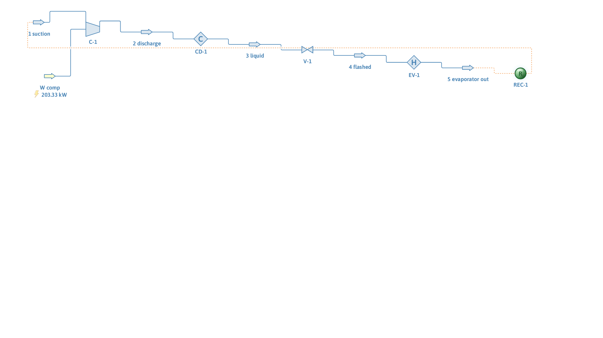

# Propane refrigeration cycle (closed loop)

**Category:** heat-integration-utilities
**Status:** community
**DWSIM version:** 10.2.0
**Language:** English
**Contributor:** Daniel Wagner Oliveira de Medeiros (@DanWBR)

## Summary

A closed R-290 (propane) vapor-compression refrigeration cycle — compressor, condenser, JT valve, evaporator — with the loop actually closed by a Recycle block rather than left as an open chain. The cycle converges, the first law closes to better than 0.01 %, and the COP comes out at 2.62, typical for the 253 K / 305 K temperature lift with a 75 % efficient compressor.

## Process description

Saturated propane vapor at 2.45 bar / 253 K is compressed adiabatically to 12.5 bar (η = 75 %), condensed and slightly subcooled at 305 K (T_sat at 12.5 bar is ~309 K), flashed through an isenthalpic valve back to 2.45 bar — about a third of the mass flashes to vapor — and fully evaporated at 253 K. The evaporator outlet feeds a Recycle block that closes the loop onto the compressor suction.

## Feed and operating conditions

| Item | Value | Unit | Notes |
|---|---|---|---|
| Circulating refrigerant | 2.0 | kg/s | pure propane |
| Suction | 2.45 bar, 253 K | | saturated vapor |
| Discharge pressure | 12.5 | bar | adiabatic, η = 75 % |
| Condenser outlet | 305 | K | subcooled liquid |
| Evaporator outlet | 253 | K | saturated vapor |

## Thermodynamics

- **Property package:** Peng-Robinson
- **Why this package:** a single light hydrocarbon over 2.5–12.5 bar; PR reproduces propane saturation properties well in this range.

## Tuning and convergence notes

- The suction stream is the recycle's tear. It must carry a **complete initial state** (T, P, flow, composition) — the values act as the initial guess and the Recycle overwrites them at each pass. Since nothing in the loop changes the mass flow, the loop converges in a couple of iterations.
- The condenser outlet spec (305 K) must sit below T_sat at the discharge pressure or the valve receives two-phase feed and the evaporator duty is understated. 12.5 bar was chosen to leave ~4 K of subcooling.
- The evaporator is a heater specified to the suction temperature; cycle closure (T out = T in of the tear) is one of the checks.

## Results

| Quantity | DWSIM | Notes |
|---|---|---|
| Compressor work | 203.3 kW | |
| First law: Q_cond = Q_evap + W | 735.58 kW = 735.58 kW | closes < 0.01 % |
| Valve outlet vapor fraction | 0.337 | flash gas |
| COP (Q_evap / W) | 2.62 | typical for this lift and η |
| Cycle closure | T_suction = T_evap out = 253 K | |

## Files

- `propane-refrigeration-cycle.dwxmz` — the DWSIM flowsheet.
- `propane-refrigeration-cycle.png` — PFD screenshot.

This case is generated and verified by an automated test in the DWSIM repository (`tests/DWSIM.FluentAPI.Tests/Samples/PropaneRefrigerationSample.cs`): built through the fluent API, solved, checked for the results above, saved, then reloaded and re-solved from the saved file.

## Confidentiality

All conditions are textbook values; no plant data was used.

## References

- Smith, Van Ness, Abbott, *Introduction to Chemical Engineering Thermodynamics* — vapor-compression refrigeration cycles.
