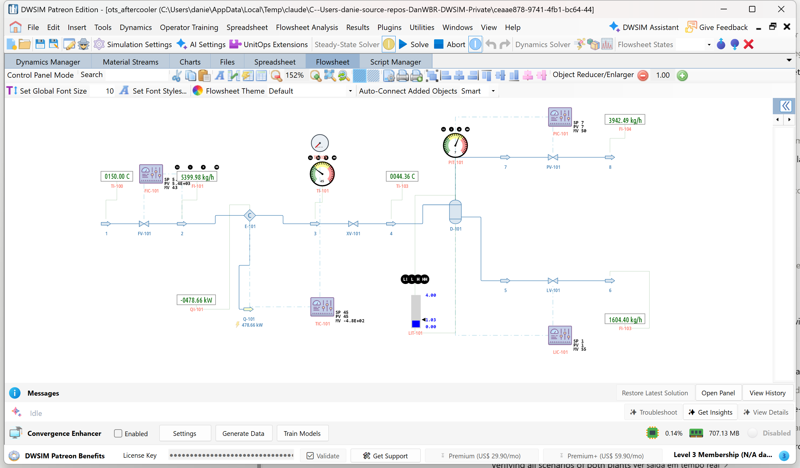

# Compressor aftercooler and knock-out drum with a scenario pack

**Category:** operator-training
**Status:** community
**DWSIM version:** 10.2.9
**Language:** English
**Contributor:** Daniel Medeiros (built with the DWSIM fluent API)

> **Requirement.** The training features (Instructor Station, scenarios, interlocks, operator screens) belong to the Operator Training Simulator extender of DWSIM Patreon level 3, Classic interface on Windows. The flowsheet itself, with its dynamics schedule, controllers and gauges, opens and runs in any DWSIM 10.2.9 or later; the scenarios, interlocks and screens travel inside the file and are simply ignored where the extender is not present. The course that goes with these plants is at [dwsim.org/tutorials](https://dwsim.org/tutorials), section Operator Training.

## Summary

Compressed gas at 150 °C is cooled to 45 °C in an aftercooler and the condensate is knocked out in a drum, with a
flow loop, a temperature loop on the cooling duty, a level loop and a pressure loop, three interlocks, two
operator screens and seven scored training scenarios about heat exchange and instrumentation: a cooling water
shortfall, a frozen and a drifting temperature transmitter, a stuck level valve, an instrument air failure and a
real-time assessment. The plant integrates with a 2 s step.

## Process description

Compressed gas at 10 bar and 150 °C enters through **FV-101** (flow loop **FIC-101**, 5 400 kg/h) into the
aftercooler **E-101**, leaves through the hand valve **XV-101** into the knock-out drum **D-101** (8 m³, 4 m tall)
at 7 bar (**PIC-101** on **PV-101** to a 6 bar header). The condensate, about 0.4 kg/s of the heavier ends, goes
through **LV-101** (**LIC-101**, 1.0 m) to a 3 bar header. The cooling duty of E-101 is what **TIC-101** sets from
the gas outlet temperature (set point 45 °C); the cooling water is behind it. The temperature controller reads
the transmitter **TT-101**; the gauge **TI-101** reads the true temperature.

| Tag | Reads | Units | LL | L | H | HH |
|---|---|---|---|---|---|---|
| TI-101, TT-101 | Gas outlet temperature | °C | 30 | 35 | 60 | 75 |
| FI-101 | Gas flow | kg/h | 1500 | 3000 | 9000 | 10000 |
| LIT-101 | D-101 level | m | 0.3 | 0.5 | 1.25 | 1.4 |
| PIT-101 | D-101 pressure | bar | 5 | 6 | 8 | 9 |
| TI-100, TI-103, QI-101, FI-103, FI-104 | Gas inlet T, drum inlet T, cooling duty, condensate, gas to header | | | | | |

| Interlock | Trips when | Actions |
|---|---|---|
| Hot gas to drum | TI-101 HH for 10 s | Close FV-101; FIC-101 to manual at 0 |
| D-101 high pressure trip | PIT-101 HH for 5 s | Close FV-101; PIC-101 to manual at 100 % |
| D-101 overfill | LIT-101 HH for 5 s | Close FV-101 |

Schedules: `schedule1` (plain) and `schedule2 (more gas)`, which raises the FIC-101 set point from 5 400 to
8 500 kg/h at 01:30. Every scenario starts from the stored state `a`.

## Feed and operating conditions

| Item | Value | Unit | Notes |
|---|---|---|---|
| Gas flow | 5 400 | kg/h | FIC-101 set point (1.5 kg/s); 8 500 in the "more gas" schedule |
| Gas composition | 61 / 10 / 8 / 6 / 5 / 5 / 5 | mol % | methane, ethane, propane, n-butane, n-pentane, n-hexane, n-heptane |
| Gas inlet | 150 °C, 10 bar | | |
| Gas outlet temperature | 45 | °C | TIC-101 set point |
| Drum | 7 bar, 1.0 m | | 8 m³, 4 m tall |
| Headers | 6 / 3 | bar | gas, condensate |

## Training content

| # | Scenario | Speed | Fault | Objectives |
|---|---|---|---|---|
| 1 | Reading the plant | 5x | none | Keep TI-101 in 35 to 60 °C and the level in 0.5 to 1.25 m; change the TIC-101 set point |
| 2 | Cooling water shortfall | 5x | E-101 loses 40 % of its capacity over 10 min from 01:00; H alarm at 06:38 | No HH temperature; temperature in range 80 %; reduce the FIC-101 set point |
| 3 | Frozen temperature transmitter | 5x | TT-101 frozen at 01:00, more gas at 01:30: TIC-101 keeps the cooling where it was; H alarm at 02:02, no HH | No HH; TIC-101 to manual within 15 min; temperature in range 70 % |
| 4 | LV-101 sticks | 10x | LV-101 stuck at 01:00, more gas at 01:30; the level climbs about 0.85 cm/min, H at 29:20, HH at about 47 min | No overfill trip; no HH level; LIC-101 to manual; reduce the gas |
| 5 | Drifting temperature transmitter | 5x | TT-101 drifts high from 02:00: TIC-101 over-cools | No LL temperature; TIC-101 to manual; temperature in range 80 % |
| 6 | Instrument air failure | 5x | All valves to fail position at 03:00 | Acknowledge; no HH temperature or pressure |
| 7 | PV-101 fails closed (real time) | 1x | PV-101 closes at 02:00 over 4 min; H at 04:02, HH at 04:54, trip at 05:00 | No HH pressure; no trip; cut the gas within 5 min |

## Thermodynamics

- **Property package:** Peng-Robinson
- **Why this package:** light hydrocarbons at 3 to 10 bar with a condensing heavy end; a cubic equation of state
  handles the partial condensation and keeps the holdup flashes fast.

## Tuning and convergence notes

- The cooler is a **Cooler block with a gas holdup** driven by a duty, and the duty is what TIC-101 manipulates.
  A shell-and-tube model with a liquid cooling-water side was tried first and abandoned: a liquid-only holdup
  fails the volume flash ("root not bracketed") and the loop oscillated wildly.
- In dynamic mode a Cooler or Heater **adds** its duty to the holdup enthalpy, so cooling is a negative duty; the
  "Utility loss" fault caps the driving controller's output limit rather than zeroing the duty.
- Water was removed from the gas: a second liquid phase in the drum broke the level calculation.
- The feed header is at 10 bar so that "PV-101 fails closed" reaches the HH pressure within the exercise; the
  first version at a lower header settled below the alarm.
- FIC-101 gains 0.1 / 0.03 and PIC-101 Kp 1.5 after the first tuning drove the flow loop into a limit cycle; the
  drum was enlarged to 8 m³ for the same reason.
- The 2 s step is what the temperature loop needs; the two separators run at 5 s.

## Results

Alarm times measured headlessly with nobody at the panel: scenario 2 temperature H at 06:38; scenario 3 H at
02:02 with no HH (the frozen transmitter holds the duty where it was, and the extra gas only pushes the true
temperature past H); scenario 4 level H at 29:20 and HH near 47 min (a slow exercise, hence 10x); scenario 7
pressure H at 04:02, HH at 04:54, trip at 05:00.

## Files

- `compressor-aftercooler-ots.dwxmz` - the flowsheet with the two schedules, the stored state, the seven
  scenarios, the three interlocks and the two screens (Overview, Cooler).
- `compressor-aftercooler-ots.png` - the flowsheet.

## Confidentiality

Nothing to anonymise: a made-up plant with textbook numbers.

## References

- DWSIM tutorials, Operator Training section, page 13 (sample plants).
- GPSA Engineering Data Book, compression and gas cooling sections, for the aftercooler and knock-out drum duty.
