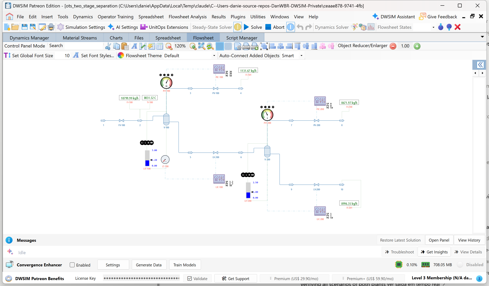

# Two-stage separation train: HP and LP separators with a scenario pack

**Category:** operator-training
**Status:** community
**DWSIM version:** 10.2.9
**Language:** English
**Contributor:** Daniel Medeiros (built with the DWSIM fluent API)

> **Requirement.** The training features (Instructor Station, scenarios, interlocks, operator screens) belong to the Operator Training Simulator extender of DWSIM Patreon level 3, Classic interface on Windows. The flowsheet itself, with its dynamics schedule, controllers and gauges, opens and runs in any DWSIM 10.2.9 or later; the scenarios, interlocks and screens travel inside the file and are simply ignored where the extender is not present. The course that goes with these plants is at [dwsim.org/tutorials](https://dwsim.org/tutorials), section Operator Training.

## Summary

A rich gas is separated in a high-pressure separator at 30 bar and a low-pressure separator at 8 bar, with two
pressure loops and two level loops, three interlocks and three operator screens, and a pack of seven scored
training scenarios: a plain reading exercise, a level valve that sticks during a feed surge, a level transmitter
that fails high and opens the way for gas blow-by, a stuck gas valve, a frozen transmitter, a plant-wide
instrument air failure and a real-time assessment. Every alarm time in the pack was measured by running the
scenario with nobody at the panel, so an instructor knows how long a trainee has.

## Process description

The feed, 3 kg/s of a seven-component gas from methane to n-heptane at 35 °C, comes from a 45 bar header through
**FV-100** into the HP separator **V-100** (6 m³, 4 m tall), held at 30 bar by **PIC-100** on the gas valve
**PV-100** to a 25 bar header. The HP condensate drops through **LV-100** (level loop **LIC-100**, set point
1.2 m) into the LP separator **V-200** (3 m³, 3 m tall) at 8 bar (**PIC-200** on **PV-200**, to a 3 bar header);
its liquid leaves through **LV-200** (**LIC-200**, 1.0 m) to a 1.5 bar header. At the design point 0.32 kg/s of
HP gas, 0.19 kg/s of LP gas and 2.5 kg/s of stabilised condensate leave the train.

The level controller of V-100 reads the **transmitter LT-100**; the gauge **LIT-100** reads the true level. A
frozen or full-scale LT-100 therefore blinds the controller while the trainee can still see the truth on LIT-100,
which is what the sensor scenarios are about.

| Tag | Reads | Units | LL | L | H | HH |
|---|---|---|---|---|---|---|
| PIT-100 | V-100 pressure | bar | 20 | 26 | 34 | 37 |
| LIT-100, LT-100 | V-100 level | m | 0.4 | 0.7 | 1.8 | 2.2 |
| PIT-200 | V-200 pressure | bar | 4 | 6 | 10.5 | 12 |
| LIT-200 | V-200 level | m | 0.3 | 0.5 | 1.6 | 2.0 |
| FI-100, FI-101, FI-200, FI-201 | Feed, HP gas, LP gas, condensate | kg/h | | | | |
| TI-100 | Feed temperature | °C | | | | |

| Interlock | Trips when | Actions |
|---|---|---|
| V-100 low level trip | LIT-100 LL for 3 s | Close LV-100; LIC-100 to manual at 0 % (gas blow-by protection) |
| V-200 high pressure trip | PIT-200 HH for 3 s | Close LV-100; PIC-200 to manual at 100 % |
| V-100 high pressure trip | PIT-100 HH for 5 s | Close FV-100 |

Three schedules: `schedule1` (plain), `schedule2 (feed surge)` steps the feed header from 45 to 50 bar at 01:30,
`schedule3 (large feed surge)` to 60 bar. Every scenario starts from the stored state `a` with a 5 s step.

## Feed and operating conditions

| Item | Value | Unit | Notes |
|---|---|---|---|
| Feed flow | 3.0 | kg/s | at the design point; the feed is pressure-specified, so it follows FV-100 |
| Feed composition | 30 / 8 / 10 / 12 / 13 / 14 / 13 | mol % | methane, ethane, propane, n-butane, n-pentane, n-hexane, n-heptane |
| Feed temperature | 35 | °C | |
| Feed header | 45 | bar | 50 and 60 bar in the surge schedules |
| V-100 | 30 bar, 1.2 m | | 6 m³, 4 m tall |
| V-200 | 8 bar, 1.0 m | | 3 m³, 3 m tall |
| Headers | 25 / 3 / 1.5 | bar | HP gas, LP gas, condensate |

## Training content

| # | Scenario | Speed | Fault | What happens without action | Objectives |
|---|---|---|---|---|---|
| 1 | Reading the plant | 5x | none | Nothing; the trainee changes the PIC-100 set point and watches | Keep PIT-100 in 26 to 33 bar and LIT-100 in 0.7 to 1.8 m; change the set point within 10 min |
| 2 | LV-100 sticks during a feed surge | 10x | LV-100 stuck at 01:00; surge at 01:30 | Level H at 17:05, HH at 27:00 | No HH; LIC-100 to manual within 25 min; level in range 80 % of the time |
| 3 | Gas blow-by | 5x | LT-100 fails high at 01:30: LIC-100 opens LV-100 wide | True level L at 04:50, LL at 06:35, low level trip at 06:40; after the trip the level climbs to HH at 17:15 | No V-200 HH; no low level trip; LIC-100 to manual within 7 min; level in 0.7 to 1.8 m 70 % of the time |
| 4 | PV-100 sticks during a feed surge | 2x | PV-100 stuck at 01:00; surge to 60 bar at 01:30 | Pressure H at 09:00, settles near 35 bar | Pressure in 26 to 33 bar 70 % of the time; no HH; no high pressure trip; throttle FV-100 within 5 min |
| 5 | Frozen level transmitter | 10x | LT-100 frozen at 01:00; surge at 01:30 | LIC-100 holds its output; true level H at 17:05, HH at 27:00 | No HH, no LL; LIC-100 to manual within 30 min; level in range 80 % |
| 6 | Instrument air failure | 5x | All valves to fail position at 03:00 | Feed stops, everything holds | Acknowledge within 5 min; no HH pressures |
| 7 | PV-100 fails closed (real time) | 1x | PV-100 closes at 02:00 over 3 min | Pressure H at 05:25, HH at 07:00, trip at 07:05 | No HH; no trip; throttle FV-100 within 5 min |

The pack follows one progression: scenario 1 has no fault and teaches the plant; 2 to 5 have one fault each, in
order of difficulty; 6 is a plant-wide failure; 7 is an assessment at real time.

## Thermodynamics

- **Property package:** Peng-Robinson
- **Why this package:** light hydrocarbons at 8 to 45 bar; a cubic equation of state gives the right phase split
  and its flashes are fast, which matters in a run with a holdup flash every step.

## Tuning and convergence notes

- **Vessel size sets the pace.** Pressure in a gas space moves in seconds, level in a liquid pool moves in
  minutes. V-100 is tall and narrow (4 m for 6 m³) so that a 0.4 kg/s liquid imbalance moves the level a few
  centimetres per minute, fast enough to see and slow enough to act on. Speeds are chosen per scenario: 2x for the
  pressure exercise, 10x for the level ones.
- **A stuck valve at steady state is invisible.** Nothing changes until something else changes, so the
  stuck-valve scenarios pair the fault with a feed surge carried by the schedule's event list.
- **A winnable fault.** The first gas blow-by used "LV-100 fails open"; with the stem locked the trainee cannot
  close it, the trip fires regardless and the exercise cannot be won. A level transmitter at full scale gives the
  same blow-by with a way out: manual, close the valve, acknowledge.
- **Kv sizing.** The steady state does not size the valves. Each valve was given the Kv its own sizing tool
  reports, then the plant was run under the training session and the Kv values rescaled so every valve sits near
  50 % open, skipping saturated ones.
- Events that change a set point must be written in the controller's own units (a `SetPointAbs` event in kg/h
  collapsed the flow); the stored state carries object data, so it was re-stored after the alarm limits were final.
- Controllers: PID gains 3.0 / 0.02 on pressure, 2.0 / 0.02 on level, offset 50 (the steady opening), span 100,
  reverse acting.

## Results

The times in the scenario table are what the plant does with nobody at the panel, measured headlessly. They tell
the instructor how long the trainee has: in scenario 3, a hundred and five seconds of simulated time between the
L and the LL alarm, twenty-one seconds of wall-clock time at 5x.

Two example exercise reports for scenario 3 are included: nobody acting (25 of 70 points; the level transmitter
lies, the controller drains the vessel, the low-level trip fires at 06:40) and a scripted operator who takes
LIC-100 to manual at 20 % at 04:00 and holds 50 % from 10:00 (70 of 70).

## Files

- `two-stage-separation-ots.dwxmz` - the flowsheet with the three schedules, the stored state, the seven
  scenarios, the three interlocks and the three screens (Overview, HP separator, LP separator).
- `two-stage-separation-ots.png` - the flowsheet.
- `report-gas-blow-by-no-operator.md`, `report-gas-blow-by-operator.md` - the exercise reports the OTS writes.

## Confidentiality

Nothing to anonymise: a made-up plant with textbook numbers.

## References

- DWSIM tutorials, Operator Training section, page 13 (sample plants) and 14 (instructor kit).
- API RP 14C / ISO 10418 for the protective functions a separator carries (low level, high pressure).
