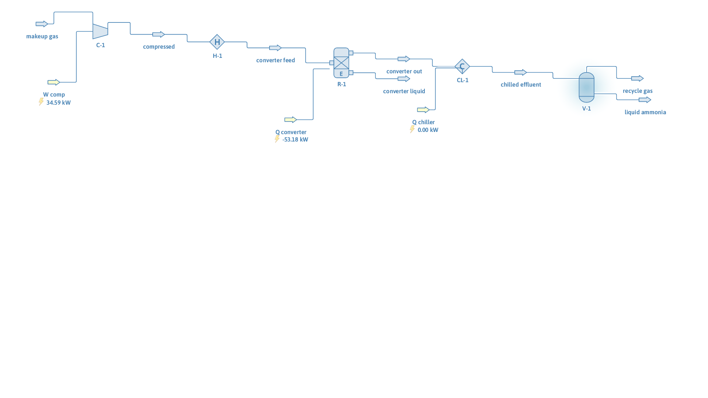

# Ammonia synthesis, single pass

**Category:** reaction-systems
**Status:** community
**DWSIM version:** 10.2.0
**Language:** English
**Contributor:** Daniel Wagner Oliveira de Medeiros (@DanWBR)

## Summary

A simplified Haber-Bosch single pass: stoichiometric 3:1 H2:N2 makeup gas is compressed to 200 bar, heated to 700 K, brought to chemical equilibrium in an equilibrium reactor (ln Keq = 11000/T − 25), chilled to 250 K and separated. N2 conversion is equilibrium-limited at 49 %, the condensed product is 99.1 mol% ammonia, and the H and N atom balances close exactly.

## Process description

Makeup gas (3 mol/s H2 + 1 mol/s N2) is compressed adiabatically from 30 to 200 bar, heated to the converter temperature of 700 K and fed to an equilibrium reactor running N2 + 3 H2 ⇌ 2 NH3 on an activity basis. The effluent is chilled to 250 K, condensing the ammonia, and a separator splits liquid ammonia product from the unconverted gas that a real plant would recycle to the converter.

## Feed and operating conditions

| Item | Value | Unit | Notes |
|---|---|---|---|
| Makeup gas | 4 | mol/s | H2:N2 = 3:1, 300 K / 30 bar |
| Converter | 700 K, 200 bar | | isothermal equilibrium reactor |
| Equilibrium expression | ln Keq = 11000/T − 25.0 | | Gillespie/Beattie-style approximation |
| Chiller outlet | 250 | K | condenses NH3 |

## Thermodynamics

- **Property package:** Peng-Robinson
- **Why this package:** H2/N2/NH3 at 200 bar; a cubic EOS is the standard treatment and PR handles the high-pressure phase split at 250 K.

## Tuning and convergence notes

- The equilibrium reaction uses **Activity** basis with the ln Keq expression written as a function of T. The expression gives the correct qualitative behavior (conversion falls as T rises); tune the two constants if you want to match a specific published Kp dataset.
- The reactor is isothermal; the exothermic heat of reaction shows up in the reactor's energy stream.
- Checked by atom balances rather than a fixed conversion: H in = H out and N in = N out across the converter to 0.5 %, which holds regardless of where equilibrium lands.

## Results

| Quantity | DWSIM | Notes |
|---|---|---|
| N2 conversion | 49.0 % | equilibrium at 700 K / 200 bar |
| NH3 produced | 0.980 | mol/s |
| H atom balance | 6.000 in / 6.000 out | mol/s |
| N atom balance | 2.000 in / 2.000 out | mol/s |
| Liquid product NH3 | 99.1 mol% | |
| NH3 slip in recycle gas | 2.2 mol% | |
| Compressor work | 34.6 kW | |

## Files

- `ammonia-synthesis-single-pass.dwxmz` — the DWSIM flowsheet.
- `ammonia-synthesis-single-pass.png` — PFD screenshot.

This case is generated and verified by an automated test in the DWSIM repository (`tests/DWSIM.FluentAPI.Tests/Samples/AmmoniaSynthesisSample.cs`): built through the fluent API, solved, checked for the results above, saved, then reloaded and re-solved from the saved file.

## Confidentiality

All conditions are textbook values; no plant data was used.

## References

- Appl, M., *Ammonia: Principles and Industrial Practice*, Wiley-VCH.
