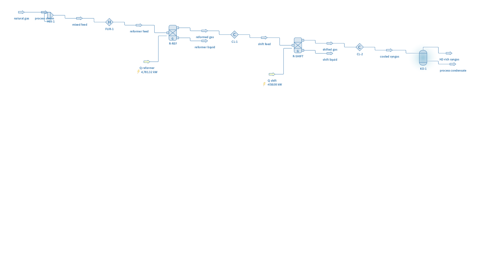

# Steam methane reforming hydrogen plant

**Category:** reaction-systems
**Status:** community
**DWSIM version:** 10.2.0
**Language:** English
**Contributor:** Daniel Wagner Oliveira de Medeiros (@DanWBR)

## Summary

A single-train steam methane reformer: natural gas and steam at S/C = 3 are preheated to 850 °C, reformed to equilibrium in a Gibbs reactor at 15 bar (89 % CH4 conversion), shifted at 350 °C in a second Gibbs reactor with methane held inert, cooled, and knocked out to a hydrogen-rich syngas at 77.6 mol% H2 on a dry basis. Carbon atoms balance across the whole train to better than 0.01 %.

## Process description

25 mol/s of methane mixes with 75 mol/s of process steam (steam-to-carbon ratio 3) and is heated to 1123 K in the reformer furnace. The Gibbs reformer minimizes free energy over CH4/H2O/CO/CO2/H2, capturing steam reforming and the internal water-gas shift simultaneously. The effluent is cooled to 623 K and enters a second Gibbs reactor representing the high-temperature shift — methane is excluded from the reacting set so it stays inert and no artificial re-methanation happens at the lower temperature. After cooling to 313 K a knockout drum removes the process condensate.

## Feed and operating conditions

| Item | Value | Unit | Notes |
|---|---|---|---|
| Natural gas | 25 | mol/s | pure CH4, 15 bar |
| Process steam | 75 | mol/s | S/C = 3 |
| Reformer | 1123.15 K, 15 bar | | isothermal Gibbs |
| Shift converter | 623.15 K | | isothermal Gibbs, CH4 inert |
| Final cooling / KO drum | 313.15 K | | |

## Thermodynamics

- **Property package:** Peng-Robinson
- **Why this package:** light gases at moderate pressure and high temperature; near-ideal vapor behavior where PR is reliable, and it handles the condensate knockout at 313 K.

## Tuning and convergence notes

- The Gibbs reactor needs its element matrix built **after** the feed is connected (`ComponentIDs` + `CreateElementMatrix()`), because the matrix is derived from the inlet stream. Both product ports (vapor and liquid) must be connected even though the liquid one is empty at reformer conditions.
- Restricting the shift reactor's `ComponentIDs` to H2O/CO/CO2/H2 is what makes it a shift converter: with methane in the set, Gibbs minimization at 623 K would re-methanate heavily, which the real catalyst does not do.
- `InitializeFromPreviousSolution = false` on both reactors keeps each solve independent of history.

## Results

| Quantity | DWSIM | Notes |
|---|---|---|
| CH4 conversion (reformer) | 89.1 % | equilibrium at 1123 K / 15 bar / S/C 3 |
| Reformer duty | +4781 kW | endothermic, as expected |
| CO after shift / CO before | 0.174 | the shift consumes 83 % of the CO |
| Carbon atom balance | 25.000 in / 25.000 out | < 0.01 % |
| Dry-basis H2 in syngas | 77.6 mol% | |
| Condensate purity | 99.9 % water | |

## Files

- `steam-methane-reforming-h2.dwxmz` — the DWSIM flowsheet.
- `steam-methane-reforming-h2.png` — PFD screenshot.

This case is generated and verified by an automated test in the DWSIM repository (`tests/DWSIM.FluentAPI.Tests/Samples/SteamMethaneReformerSample.cs`): built through the fluent API, solved, checked for the results above, saved, then reloaded and re-solved from the saved file.

## Confidentiality

All conditions are literature-typical values; no plant data was used.

## References

- Rostrup-Nielsen, J. R., "Catalytic Steam Reforming", in *Catalysis: Science and Technology*.
- Moulijn, Makkee, van Diepen, *Chemical Process Technology* — hydrogen production by SMR.
