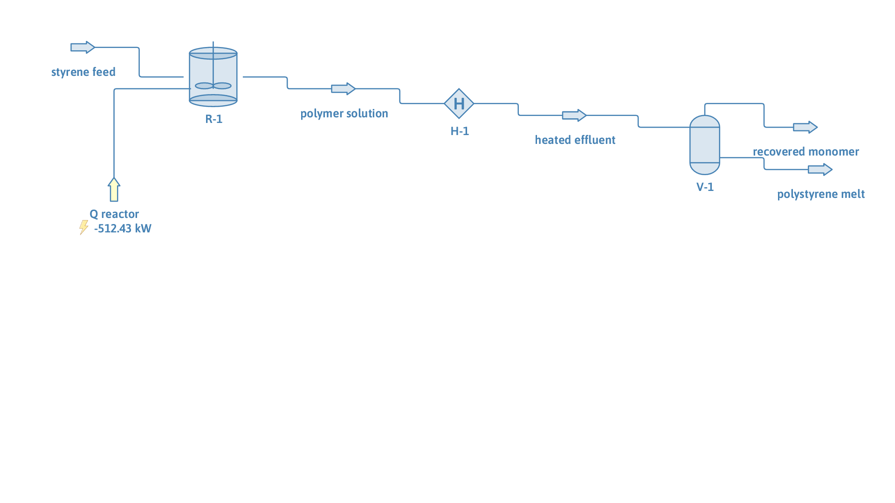

# Bulk styrene polymerization with monomer recovery

**Category:** reaction-systems
**Status:** community
**DWSIM version:** 10.2.5
**Language:** English
**Contributor:** Daniel Wagner Oliveira de Medeiros (@DanWBR)

## Summary

A free-radical polymerization reactor turns part of a styrene feed into polystyrene, and the unreacted monomer is recovered downstream by devolatilization. The reactor is a stirred tank solved by the method of moments: it reports not just a conversion but the number- and weight-average molar masses and the polydispersity of the polymer it makes. At 90 C with about 1 wt% initiator and a large residence time it reaches 78.5 % conversion, a number-average molar mass near 20 000 g/mol and a polydispersity of 1.50, the value the free-radical mechanism gives for termination by combination. The reactor effluent, polymer dissolved in leftover monomer, is then heated to 470 K under vacuum and flashed: the residual monomer leaves as vapour and the polystyrene stays as a 99 wt% melt.

## Process description

A styrene feed (1 kg/s, about 1 wt% soluble initiator) enters a polymerization reactor (CSTR, isothermal at 90 C, 30 m3). The reactor converts styrene to polystyrene and writes the polymer, at its computed number-average molar mass, into its product stream together with the unreacted monomer. That stream is heated to 470 K and its pressure dropped to 0.15 bar; a flash vessel then separates the recovered monomer vapour from the concentrated polystyrene melt.

## Feed and operating conditions

| Item | Value | Unit | Notes |
|---|---|---|---|
| Feed | 1.0 | kg/s | 0.99 monomer / 0.01 initiator (wt) |
| Reactor | 90 C, 30 m3 | | isothermal CSTR |
| Devolatilizer | 470 K, 0.15 bar | | heater + flash vessel |

## Results

| Quantity | Value |
|---|---|
| Monomer conversion | 78.5 % |
| Number-average molar mass, Mn | 19 964 g/mol |
| Weight-average molar mass, Mw | 29 952 g/mol |
| Polydispersity, Mw/Mn | 1.50 |
| Polystyrene in the melt | 99.1 wt% |
| Polymer in the recovered vapour | 0 |

## Thermodynamics

- **Property package:** PC-SAFT (polystyrene as a non-volatile polymer)
- **Why this package:** the reactor makes a polymer that has to leave as a real, non-volatile species and then be concentrated by flashing off the monomer. PC-SAFT's polymer form grows the segment number with the molar mass, keeps the polymer in the liquid, and lets the dedicated polymer flash strip the monomer while conserving the whole polymer feed.

## Modelling notes

The most valuable part of this case.

- **Ethylbenzene stands in for styrene.** Styrene has no shipped PC-SAFT parameters, so ethylbenzene, its saturated analogue, is used as the monomer; it flashes cleanly and has the right volatility for the devolatilizer. n-Pentane stands in for a soluble initiator. The reactor kinetics are the AIBN-initiated styrene set (the styrene preset), so the molar mass and polydispersity are those of real polystyrene.
- **The reactor reports a molecular weight, not just a conversion.** The polymerization reactor solves the free-radical population balance by the method of moments, so it returns Mn, Mw and the polydispersity. Here Mw/Mn = 1.50, the theoretical value for termination purely by combination with negligible chain transfer, which is how styrene behaves.
- **Molar mass is set by the initiator level.** About 1 wt% initiator gives Mn near 20 000 g/mol; more initiator makes more (shorter) chains and a lower molar mass, less initiator makes fewer (longer) chains and a higher one. The conversion is set by the residence time (the reactor volume): a larger vessel converts more monomer.
- **Devolatilization keeps the polymer in the liquid.** The polystyrene is non-volatile; the flash strips the residual monomer as vapour and leaves a 99 wt% melt, with no polymer in the vapour. See the polystyrene devolatilization case for the flash details.

## How it was built

This flowsheet is generated and verified by the DWSIM FluentAPI sample `StyrenePolymerizationSample`. The saved file is re-opened and re-solved as a publishing check.
