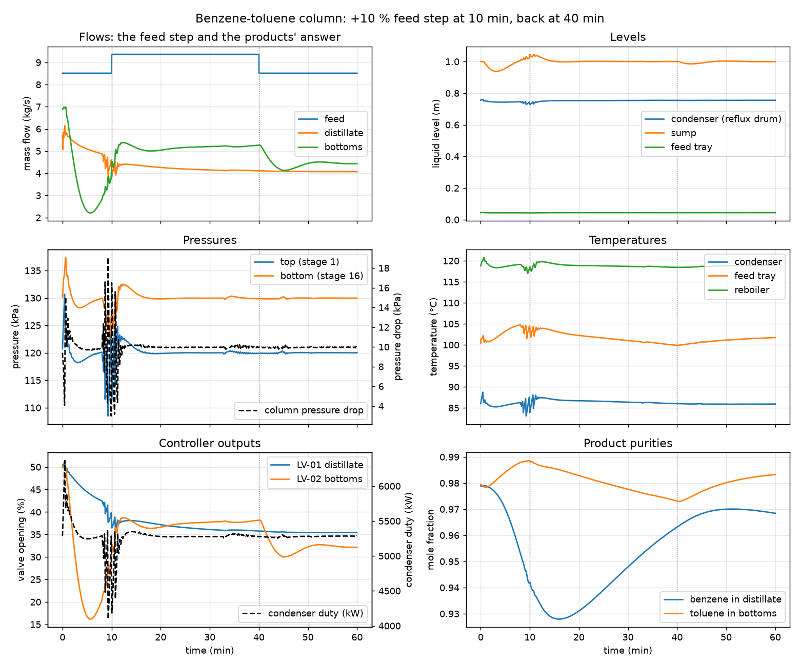

# Benzene-toluene column in dynamics: level and pressure control riding a feed step

**Category:** separation-processes
**Status:** community
**DWSIM version:** 10.2.9
**Language:** English
**Contributor:** Daniel Medeiros (built with the DWSIM fluent API, script in the DWSIM repository)

## Summary

A 16-stage benzene-toluene column is run in dynamic mode with tray hydraulics from the column
internals rating, a level controller on the reflux drum acting on the distillate valve, a level
controller on the sump acting on the bottoms valve, and a pressure controller acting on the
condenser duty. The feed is stepped up by 10 % at 10 min and back at 40 min. The run shows how
the tray levels, the column pressure drop, the temperature profile and the product purities move
and how the three controllers bring the levels and the pressure back. The file stores the product
valves half open, so the first quarter of the hour is also the level loops finding the working
openings; the step back at 40 min is the clean disturbance on a settled column. The flowsheet
opens with the schedule configured: press play on "Feed step run".

## Process description

The feed, 100 mol/s of an equimolar benzene-toluene mixture at 95 °C and 1.5 bar, enters stage 8
of a 16-stage column (condenser stage 1, reboiler stage 16). The steady state is solved with a
reflux ratio of 2.5 and a bottoms rate of 50 mol/s, top pressure 1.2 bar and 10 kPa of column
pressure drop, which gives about 98 % benzene in the distillate and 98 % toluene in the bottoms.

For the dynamic run the column carries the hydraulics of sieve trays sized by the column internals
tool at 75 % of flood: 2.58 m diameter, 0.5 m tray spacing, 12 % downcomers (weir 1.88 m), 50 mm
weirs and 10 % hole area. The condenser stage doubles as the reflux drum (2 m of vessel) and its
liquid leaves through a short reflux line, a 1 m dead height plus a 0.05 m outlet, which holds
about 0.75 m of liquid at the design reflux and makes the reflux a gentle function of the drum
level. The reboiler stage doubles as the sump (2 m of vessel below the last
tray) and starts half full (1 m). The dry tray coefficients are calibrated at initialisation so the
steady-state vapour rate crosses each tray at the steady-state pressure drop.

The stage levels the model reports are clear liquid heights. The seeding puts each tray at the
Francis weir level for the steady-state liquid rate times an aeration factor of 0.6, which gives
4.4 cm on the rectifying trays and 4.9 to 5.3 cm on the stripping trays: below the 50 mm weir,
because the froth on the tray stands taller than the clear liquid it contains (about 7.3 cm of
froth on a rectifying tray).

Products leave through valves in Kv mode (Kv 150, linear characteristic) into 0.9 bar boundaries.
Both products are saturated liquids, so the flow through each valve is choked liquid flow: the
pressure drop that counts is FL² (P1 - FF Pv), about 0.08 bar on the distillate and 0.15 bar on
the bottoms (which carries the sump head), and the working openings at the design rates are 35 %
on the distillate valve and 32 % on the bottoms valve. The file stores both valves at 50 %, where
they pass 5.7 kg/s of distillate and 6.9 kg/s of bottoms against 3.9 and 4.6 kg/s of design: the
first minutes of any run from the file are the level loops closing the valves to their working
openings (see Results). To start from a settled column, run twenty minutes without events and
save that state, or store the valves at 35 and 32 % with the level controllers' offsets at the
same values.

Three PID controllers close the loops:

| Controller | Measures | Moves | Tuning (Kp, Ki) |
|---|---|---|---|
| LC-01 | reflux drum level (stage 1) | distillate valve LV-01 | 1.5, 0.01 |
| LC-02 | sump level | bottoms valve LV-02 | 2.0, 0.02 |
| PC-01 | top pressure (stage 1) | condenser duty | 2.0, 0.02 |

The reboiler duty is held at its steady-state value. A chart object on the PFD shows the variables
monitored by the integrator, a second one the column temperature profile, and a property table
and a master table list the column and stream results.

## Feed and operating conditions

| Item | Value | Unit | Notes |
|---|---|---|---|
| Feed flow | 100 | mol/s | 8.51 kg/s, stepped to 9.36 kg/s at 600 s and back at 2400 s |
| Feed composition | 50 / 50 | mol % | benzene / toluene |
| Feed temperature | 95 | °C | sub-cooled liquid at 1.5 bar |
| Top pressure | 120 | kPa | 10 kPa column pressure drop |
| Reflux ratio | 2.5 | | steady-state specification |
| Bottoms rate | 50 | mol/s | steady-state specification |
| Condenser / reboiler duty | 5285 / 5428 | kW | steady state |
| Product valves | 50 | % open | stored opening; 35 % and 32 % are the working openings at the design rates |
| Integration | 2 s steps, 2 sub-steps | | 1 h of simulated time in about 17 min |

## Thermodynamics

- **Property package:** Peng-Robinson
- **Why this package:** two non-polar aromatics near atmospheric pressure; a cubic equation of
  state reproduces the vapour-liquid equilibrium well and its flashes are fast, which matters in a
  run with tens of thousands of stage flashes.
- **Interaction parameters / assays:** the built-in binary.

## Tuning and convergence notes

- The dynamic column runs with the quasi-steady vapour option: each tray keeps only the vapour
  its free volume holds and passes the rest up within the step; the stage pressures follow the
  tray hydraulics from the drum downward; the drum pressure is the bubble pressure of its liquid.
  Without it (the pressure-driven vapour holdup on every tray) the vapour balance has a time
  constant of milliseconds and no practical step is stable.
- Initialisation matters: the trays start at the level that passes the steady-state liquid rate
  over the weir, the sump half full, and the tray coefficients calibrated to the steady-state
  pressure profile (column dynamic properties "Calibrate Tray Coefficients" and "Quasi-Steady
  Vapor", both on in the file).
- The column diameter is a dynamic input. Every steady-state solve of the column re-estimates its
  diameter from a flooding correlation (2.78 m here), and the dynamic model reads that field for
  the tray areas and the drum and sump volumes. The file carries the rated 2.58 m; after a
  steady-state re-solve, put 2.58 m back in the column's estimated diameter before pressing play,
  or every level reads 14 % lower for the same holdup and the drum and the sump answer 16 %
  slower than in the run recorded here.
- The steady-state valve calculation writes the pressure the half-open valve produces at the
  design rate (1.16 bar on the distillate, 1.24 bar on the bottoms) into the product boundaries.
  Put 0.9 bar back on both boundaries after every steady-state solve, or the valves have no
  driving force in the run and the levels climb.
- The pressure controller is the sensitive loop: the drum answers the condenser duty within
  seconds, so a gain of 20 on the normalised error drove the duty between its limits; 2 holds
  the pressure within a few kilopascals through the feed step, outside the burst episode.
- The reflux is not controlled: it is what the drum outlet passes at the drum level, so the reflux
  rises with the drum level and the distillate valve takes the balance. With a full-width weir on
  the drum the reflux was a cliff function of the level and a 2 % level dip stopped it. Product
  purities drift with the feed rate because nothing controls composition.
- Sub-steps of 1 s are enough once the vapour is quasi-steady; the liquid time constant of a
  tray is about 8 s.

## Results

The run integrates one hour in about seventeen minutes of wall time (2 s steps, 1 s sub-steps, 17
stage holdups flashed per sub-step). It has three parts: the settling of the stored state during
the first seventeen minutes, on which the feed step at 10 min lands; the high-feed plateau; and
the step back at 40 min, which hits a settled column.

**Settling, 0 to 17 min.** The first half minute is the seeded vapour balance finding itself: the
top pressure rises from 120.7 to 130.7 kPa at 26 s, PC-01 pushes the condenser to 6366 kW at
28 s, and the pressure is within 2 kPa of setpoint from 1 min on. The valves at 50 % pass 5.7 kg/s
of distillate and 6.9 kg/s of bottoms against 3.9 and 4.6 kg/s of design, so both levels fall:
the sump reaches 0.938 m at 3.2 min and the drum 0.743 m at 4 min, and the reflux, which is what
the drum outlet passes at the drum level, falls from 128 to 108 mol/s at 5 min. LC-02 closes the
bottoms valve to 16.2 % at 5.7 min (2.2 kg/s of bottoms), the sump crosses its setpoint at
7.6 min, stands at 1.039 m when the feed step arrives at 10 min and peaks at 1.046 m at 10.8 min;
it is within 5 mm of setpoint from 14.3 min and within 2 mm from 16.9 min, with the bottoms valve
at 37 %, its working opening under the +10 % feed. LC-01 takes the distillate valve from 50 to
38 % by 10 min and the drum is within 5 mm of setpoint from 12.9 min. The vapour to the condenser
comes in bursts between 8.3 and 11.7 min (top pressure 108.5 kPa at 9.3 min, 125.0 kPa at
10.6 min, column pressure drop 3.0 to 19.1 kPa, reflux down to 91 mol/s and the drum to 0.728 m):
the quasi-steady vapour answering the pressure transient that the sump overshoot and the feed
step make together. The episode dies out on its own and the pressure is within 1 kPa of setpoint
from 14.5 min on.

**Purities.** Nothing controls composition, and the settling costs more purity than the feed step.
Benzene in the distillate falls from 0.979 to 0.942 at 10 min while the reflux follows the drum
level down, reaches its low of 0.928 at 15.9 min, and climbs back to 0.963 at 40 min and 0.968 at
60 min. Toluene in the bottoms goes up first, to 0.989 at 10 min, while the bottoms rate is
collapsed to 2.2 kg/s; then the +10 % feed with the reboiler duty fixed leaves the column as
extra bottoms (5.21 kg/s on average between 25 and 40 min against 4.46 kg/s between 50 and
60 min, the distillate only 0.07 kg/s higher) and the toluene purity slides to 0.973 at 40 min;
it recovers to 0.983 at 60 min.

**Step back, 40 min.** On the settled column the same 10 % of feed is a small event: the sump dips
to 0.985 m at 42.8 min and is back within 1 cm at 44.9 min, the bottoms valve goes from 38 to
30 % at 45.2 min and settles at 32 %, the feed tray temperature climbs from 99.9 °C at the step
(its lowest of the hour) to 101.7 °C, and the top pressure and the drum level never leave
120.0 ± 0.3 kPa and 0.755 ± 0.001 m.

| Quantity | DWSIM | Notes |
|---|---|---|
| Top pressure, first minute | 120.7 to 130.7 kPa at 26 s | the seeded vapour balance settling; PC-01 answers with 6366 kW at 28 s |
| Top pressure, burst episode 8.3 to 11.7 min | 108.5 kPa at 9.3 min to 125.0 kPa at 10.6 min | setpoint 120.0 kPa; 118 to 123 kPa at all other times after the first minute |
| Column pressure drop in the episode | 3.0 to 19.1 kPa | 10 kPa at steady state |
| Sump level, settling | 0.938 m at 3.2 min, 1.046 m at 10.8 min | setpoint 1.000 m; within 2 mm from 16.9 min |
| Bottoms valve | 50 % stored, 16.2 % at 5.7 min, 38.8 % at 12.4 min | 32 % at the design rate, 37 % under the +10 % feed |
| Bottoms flow | 2.2 kg/s at 5.6 min, 5.39 kg/s at 12.3 min | 4.59 kg/s at design |
| Reflux drum level | 0.728 m at 10.0 min to 0.762 m at 26 s | setpoint 0.755 m |
| Reflux | 128 mol/s at start, 91 mol/s at 9.3 min, 122 mol/s at the end | 125 mol/s at design; follows the drum level |
| Condenser duty | 4096 kW at 9.3 min to 6366 kW at 28 s | 5285 kW at design |
| Feed tray temperature | 99.9 to 104.8 °C | 100.3 °C at design |
| Benzene in distillate | 0.979 at start, 0.928 at 15.9 min, 0.968 at 60 min | 0.9793 at design; no composition control |
| Toluene in bottoms | 0.989 at 10 min, 0.973 at 40 min, 0.983 at 60 min | 0.9794 at design |
| Step back at 40 min: sump, bottoms valve | 0.985 m at 42.8 min; 38 to 30 % | pressure and drum level within 0.3 kPa and 1 mm |
| End of the hour: sump level, top pressure, bottoms flow | 1.000 m, 120.0 kPa, 4.43 kg/s | levels and pressure back on setpoint |

What to look at: the sump level and the bottoms valve carry the feed step (a 10 % feed increase
with the reboiler duty fixed leaves the column as extra bottoms), the pressure controller holds
the top within a few kilopascals by trimming the condenser duty, the temperature profile slides a
few degrees while the extra liquid runs through, and the bottoms toluene purity falls by a point
and a half because nothing controls composition; it recovers once the feed returns. Compare the
step up, which lands on the settling column, with the step back, which lands on a settled one: a
disturbance should be applied to a column at rest. No comparison against plant or another
simulator: the case is a model exercise, and the point is the behaviour of the loops, not the
numbers.

## Files

- `benzene-toluene-column-dynamics.dwxmz` - the flowsheet, steady state solved, dynamics schedule
  "Feed step run" configured with the integrator, the event set and the monitored variables.
- `benzene-toluene-column-dynamics.png` - the PFD.
- `feed-step-response.png` - the monitored variables over the hour.
- `feed-step-run.csv` - the monitored variables, one row per integration step.

## Confidentiality

Nothing to anonymise: an academic mixture and made-up operating conditions.

## References

- Skogestad, S., "Dynamics and control of distillation columns: a tutorial introduction",
  Trans IChemE 75A (1997) 539-562, for the quasi-steady vapour and the level/pressure loop
  structure.
- Kister, H. Z., Distillation Design, McGraw-Hill (1992), for the tray hydraulics.
