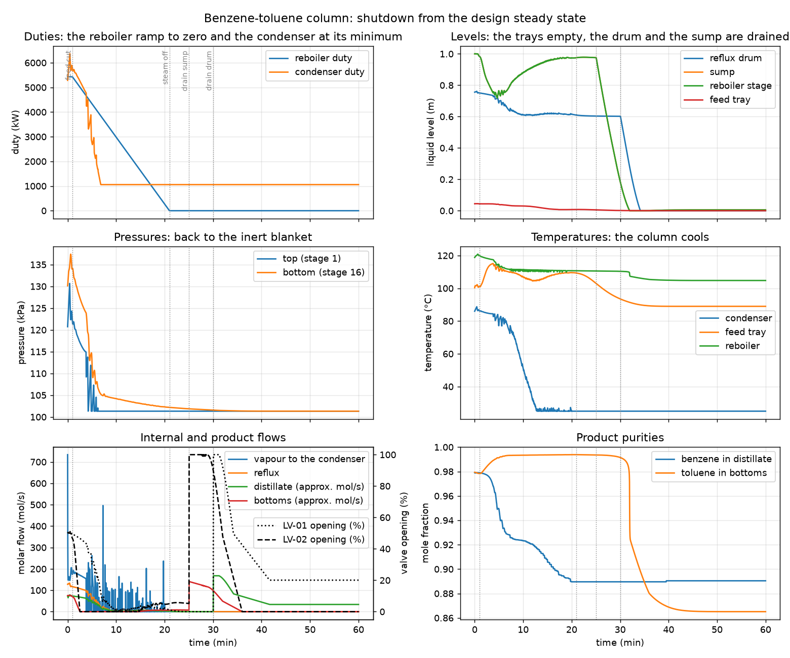

# Benzene-toluene column shutdown: from the design steady state to a drained, cold column

**Category:** separation-processes
**Status:** community
**DWSIM version:** 10.2.9
**Language:** English
**Contributor:** Daniel Medeiros (built with the DWSIM fluent API, script in the DWSIM repository)

## Summary

The benzene-toluene column of the companion cases ("Benzene-toluene column in dynamics",
"Benzene-toluene column startup") is shut down from its design steady state. The feed is cut, the
reboiler steam is ramped to zero over twenty minutes while the reflux keeps running (total reflux),
the pressure controller takes the condenser duty down as the boilup dies and the column falls back
to its inert blanket, and the sump and the reflux drum are then drained through their level
controllers by lowering the level setpoints. The flowsheet opens with the schedule configured:
press play on "Shutdown".

## Process description

The column, its tray hydraulics, its valves and its three control loops are those of the companion
cases (16 stages, equimolar benzene-toluene feed of 100 mol/s at 95 °C on stage 8, reflux ratio 2.5,
bottoms 50 mol/s, top pressure 1.2 bar, sieve trays sized at 75 % of flood, the condenser stage as
a 2 m reflux drum, the reboiler stage as a 2 m sump, Kv valves into 0.9 bar boundaries, LC-01 on
the drum level, LC-02 on the sump level, PC-01 on the top pressure acting on the condenser duty).
The dynamic holdup is seeded from the steady state; the tray weeping option is on so the trays
drain through their holes once the vapour no longer holds the liquid; the minimum drum pressure is
1 atm (the inert blanket the column returns to).

The procedure, as events of the "Shutdown" event set:

| Time | Action | Why |
|---|---|---|
| 1 min | feed cut (feed mass flow to zero) | nothing more to separate; the column runs on its inventory |
| 1 to 21 min | reboiler duty ramped linearly to zero | the boilup dies under total reflux, the pressure controller closes the condenser as the vapour disappears |
| 25 min | LC-02 setpoint lowered to 0.10 m | the sump is drained through the bottoms valve |
| 30 min | LC-01 setpoint lowered to 0.05 m | the reflux drum is drained through the distillate valve |

## Feed and operating conditions

| Item | Value | Unit | Notes |
|---|---|---|---|
| Initial state | design steady state | | 0.755 m in the drum, 1.00 m in the sump, 120 kPa at the top |
| Feed | 100 to 0 | mol/s | cut at 1 min |
| Reboiler duty | 5428 to 0 | kW | ramp from 1 to 21 min |
| Minimum pressure | 101.3 | kPa | the inert blanket |
| Integration | 2 s steps, 2 sub-steps | | 1 h of simulated time in about 12 min |

## Thermodynamics

- **Property package:** Peng-Robinson
- **Why this package:** two non-polar aromatics near atmospheric pressure; a cubic equation of
  state reproduces the vapour-liquid equilibrium well and its flashes are fast.
- **Interaction parameters / assays:** the built-in binary.

## Tuning and convergence notes

- The shutdown is harder on the model than the startup: everything falls at once and every holdup
  crosses its bubble point at about the same time. Three things had to be fixed before the run made
  sense, all in the engine now: the vapour a stage sends up is what arrived to it during the sub-step
  plus a slow correction of its inventory (a mass balance, where a rate limiter hunted), the weeping through the tray holes is
  gentle (no faster than a fiftieth of the tray liquid per second) so a tray that loses its vapour
  does not send a slug of liquid down the column, and a pressure-enthalpy flash that comes back on
  the wrong side of the bubble point (as vapour at the bubble temperature, a latent heat above the
  enthalpy asked for) is put back on the liquid side.
- The pressure controller keeps a minimum condenser duty of 20 % of the design value (the cooling
  water never fully closes). Once the boilup dies the column falls to the blanket pressure, the
  condenser sub-cools the drum liquid to the coolant temperature, and the cold reflux condenses the
  last vapour on the top trays: the steady flow of vapour to the condenser stops at 4 min while the
  reboiler still makes vapour, which condenses inside the column and heats the trays.
- Draining through the level controllers: lowering a level setpoint (the PID property "SetPointAbs",
  by an event) opens the valve wide and drains the vessel; the flow through the valve is what the
  pressure difference gives, about 13 kg/s for both.
- While the boilup dies (3 to 20 min) the vapour reaches the condenser in bursts of a few hundred
  mol/s a minute apart rather than as a steady trickle: a tray that has just lost its vapour holds
  the next arrival until its free volume is full again and then passes it on. The bursts are
  bounded and the pressure does not follow them; they are a feature of the quasi-steady vapour
  at low rates, not of the column.

## Results

The run integrates one hour in about ten minutes of wall time. What happens, in order:

| Time | Event |
|---|---|
| 1 min | feed cut; the bottoms valve closes within a minute and a half as LC-02 holds the sump level |
| 1 to 21 min | reboiler duty ramps to zero; the top pressure falls to the blanket at 4 min, and from then on the vapour condenses inside the column on the trays cooled by the sub-cooled reflux |
| 4 min | condenser duty at its minimum (1057 kW); the drum liquid cools and reaches the coolant temperature at 13 min |
| 22 min | the reflux dies (the drum level falls below the dead height of the reflux line) |
| 21 min | reboiler duty zero; the column sits under its blanket, the trays slowly draining through their holes |
| 25 min | LC-02 setpoint to 0.10 m: the bottoms valve opens fully and the sump drains to 0.19 m at 30 min, 0.05 m at 31 min |
| 30 min | LC-01 setpoint to 0.05 m: the distillate valve opens and the drum drains to 0.1 m at 33 min, empty at 34 min |
| 34 to 60 min | nothing left to move: the column is empty of liquid but for the films on the trays, at the blanket pressure |

| Quantity | DWSIM | Notes |
|---|---|---|
| Top pressure, from 4 min on | 101.3 kPa | the blanket |
| Bottom pressure, highest after the feed cut | 112 kPa | at 5 min |
| Sump level, highest before the drain | 0.98 m | at 22 min; setpoint 1.00 m |
| Bottoms flow, peak during the drain | 13.0 kg/s | LV-02 fully open |
| Distillate flow, peak during the drain | 13.1 kg/s | LV-01 fully open |
| Feed tray temperature | 100 °C at the start, 110 °C at 20 min, 94 °C at 30 min, 89 °C at the end | the trays heat while the vapour condenses on them, then cool as they drain |
| Reboiler temperature | 119 °C at the start, 111 °C at 20 min, 105 °C at the end | |
| Sump and drum at the end | 0.005 m, 0.000 m | drained |

What to look at: the pressure that falls to the blanket in three minutes once the reboiler duty
starts down, the condenser that keeps cooling the drum to the coolant temperature, the vapour that
stops reaching the condenser long before the reboiler is off, and the two drains, each a wide-open
valve for a few minutes. The product purities mean little once the products stop flowing; the
distillate composition shown after 30 min is that of the last liquid the drum held. No comparison
against plant or another simulator: the case is a model exercise.

## Files

- `benzene-toluene-column-shutdown.dwxmz` - the flowsheet, steady state solved, dynamics schedule
  "Shutdown" configured with the integrator, the event set and the monitored variables.
- `benzene-toluene-column-shutdown.png` - the PFD.
- `shutdown-response.png` - the monitored variables over the hour.
- `shutdown-run.csv` - the monitored variables, one row per integration step.

## Confidentiality

Nothing to anonymise: an academic mixture and made-up operating conditions.

## References

- Kister, H. Z., Distillation Operation, McGraw-Hill (1990), for the shutdown procedure.
- Skogestad, S., "Dynamics and control of distillation columns: a tutorial introduction",
  Trans IChemE 75A (1997) 539-562, for the quasi-steady vapour and the loop structure.
