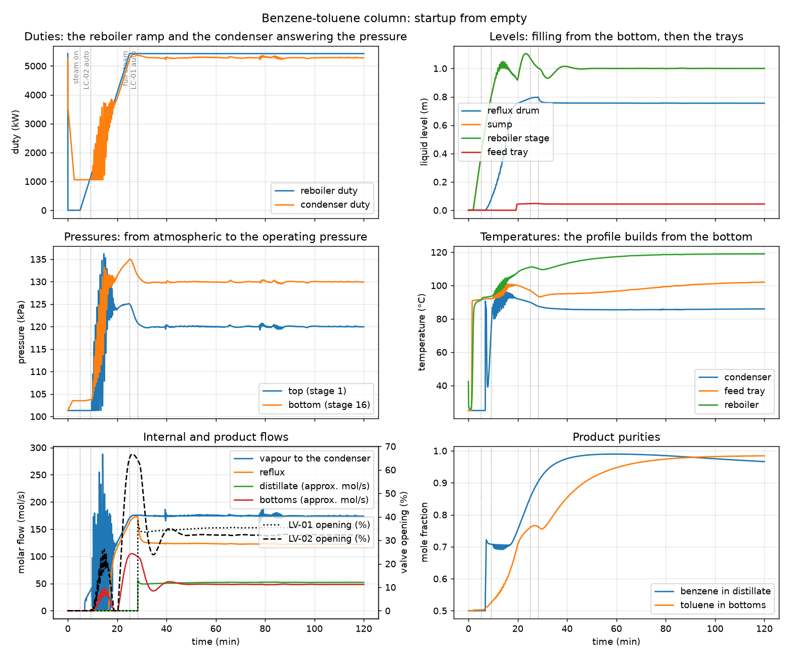

# Benzene-toluene column startup: from an empty, cold column to the design steady state

**Category:** separation-processes
**Status:** community
**DWSIM version:** 10.2.9
**Language:** English
**Contributor:** Daniel Medeiros (built with the DWSIM fluent API, script in the DWSIM repository)

## Summary

The benzene-toluene column of the companion case "Benzene-toluene column in dynamics" is started
from empty: cold, at atmospheric pressure under its inert blanket, product valves closed and the
level controllers in manual. The schedule is an operating procedure with times. The feed fills the
column from the bottom (the liquid falls through the holes of the trays until there is vapour to
hold it up), the reboiler steam is ramped once its stage is covered, the vapour climbs the empty
trays and fills the reflux drum, the reflux starts by itself on the drum level, the column
pressurises from atmospheric to the setpoint of the pressure controller, and the two level
controllers are switched to automatic when their levels exist. Two hours later the column sits at
the steady state it was designed for. The flowsheet opens with the schedule configured: press play
on "Startup".

## Process description

The column is the one of the companion case: 16 stages (condenser stage 1, reboiler stage 16),
equimolar benzene-toluene feed of 100 mol/s at 95 °C on stage 8, reflux ratio 2.5 and bottoms rate
50 mol/s at the design point, top pressure 1.2 bar, 10 kPa of column pressure drop, sieve trays
sized by the column internals tool (2.58 m diameter, 12 % downcomers, 50 mm weirs, 10 % hole
area), the condenser stage doubling as a 2 m reflux drum with a short reflux line, and the reboiler
stage doubling as a 2 m sump. Products leave through Kv valves into 0.9 bar boundaries.

The column dynamic properties that make the startup possible, all set in the file:

| Property | Value | What it does |
|---|---|---|
| Quasi-Steady Vapor | on | the vapour passes through the column within the step; the drum is the pressure state |
| Start Empty | on | the first step seeds a film of feed-composition liquid on every stage instead of the steady state |
| Initial Pressure / Temperature | 1 atm / 25 °C | the inert blanket and the cold column |
| Minimum Pressure | 1 atm | the drum cannot fall below the blanket |
| Coolant Temperature | 25 °C | the condenser removes no heat from a holdup colder than its coolant |
| Tray Weeping | on | a tray drains through its holes when the vapour does not hold the liquid up (Fair) |
| Calibrate Tray Coefficients | on | dry tray coefficients from the design pressure profile |

The procedure, as events of the "Startup" event set:

| Time | Action | Why |
|---|---|---|
| 0 | feed on at its design rate; reboiler steam off; product valves closed; LC-01 and LC-02 in manual (output 0); PC-01 in automatic | the column fills from the bottom |
| 5 min | reboiler duty ramp starts | the reboiler stage is covered |
| 9 min | LC-02 (sump level) to automatic | the sump is close to its setpoint |
| 25 min | reboiler duty reaches its design value | the ramp of 20 min avoids a vapour surge |
| 28 min | LC-01 (drum level) to automatic | the drum has filled and the reflux is running |

Three PID controllers: LC-01 on the drum level acting on the distillate valve, LC-02 on the sump
level acting on the bottoms valve, PC-01 on the top pressure acting on the condenser duty. The
pressure controller is in automatic from the start with a minimum output of 20 % of the design duty
(the cooling water never fully closes): while the column is at atmospheric pressure the condenser
condenses what little vapour arrives at that minimum, and the moment the drum holds liquid and the
pressure passes the setpoint the controller takes over, which is what pressurises the column.

## Feed and operating conditions

| Item | Value | Unit | Notes |
|---|---|---|---|
| Feed flow | 100 | mol/s | 8.51 kg/s, on from t = 0 |
| Feed composition | 50 / 50 | mol % | benzene / toluene |
| Feed temperature | 95 | °C | flashes a little on entering the cold column at 1 atm |
| Initial state | 25 °C, 1 atm | | empty, inert blanket |
| Top pressure setpoint | 120 | kPa | PC-01 on the condenser duty |
| Reboiler duty ramp | 0 to 5428 | kW | from 5 to 25 min |
| Level setpoints | 0.755 / 1.000 | m | drum / sump, the design levels |
| Integration | 2 s steps, 2 sub-steps | | 2 h of simulated time in about 30 min |

## Thermodynamics

- **Property package:** Peng-Robinson
- **Why this package:** two non-polar aromatics near atmospheric pressure; a cubic equation of
  state reproduces the vapour-liquid equilibrium well and its flashes are fast, which matters in a
  run with tens of thousands of stage flashes.
- **Interaction parameters / assays:** the built-in binary.

## Tuning and convergence notes

- A startup exercises parts of the model that normal operation never does: vapour arriving at
  empty trays, a reboiler with no liquid returning to it, a controller saturated for a quarter of
  an hour, a product valve against a column at atmospheric pressure. Each of these had to work
  before the run made sense, and the case is as much about the model as about the procedure.
- The reboiler stage is the sump. With a separate, unheated sump below the reboiler stage the
  stage boiled dry while the sump held a metre of liquid, because the trays above were still
  filling and nothing came back down. A kettle or thermosiphon reboiler boils the column bottoms;
  the model now does the same.
- The level controllers start in manual with the valves closed and are switched to automatic by
  events. The PID property to use is "ManualOverride" (0 for automatic); in manual the controller
  writes its manual output to the valve.
- A ramp event starts from the value recorded before its reference event: a step to zero at t = 0
  and a second step to zero where the ramp begins give a ramp that starts from zero.
- The product boundaries are set to 0.9 bar after the steady-state solve; the steady-state valve
  calculation would otherwise leave them at the pressure a half-open valve produces, and a column
  at atmospheric pressure could not push its bottoms out.
- Vapour that arrives at a tray passes on at once: what a stage sends up is what arrived to it during
  the sub-step plus a slow correction of its inventory. A rate limiter on the vapour, meant to damp
  the pressure-flash loop in normal operation, held vapour back on the trays during the startup and
  released it later as a pressure surge.

## Results

The run integrates two hours in about thirty minutes of wall time (2 s steps, 1 s sub-steps, 17
holdups flashed per sub-step). What happens, in order:

| Time | Event |
|---|---|
| 0 to 12 min | the feed fills the column: the liquid falls through the holes of the cold trays to the reboiler stage, which is the sump; its level reaches 1 m at 12 min |
| 5 min | the reboiler steam ramp starts (its stage is covered); by 7 min the vapour from the feed flash and the first boilup reaches the condenser |
| 9 min | LC-02 to automatic; the bottoms valve opens once the level passes its setpoint and the bottoms leave from 10 min |
| 10 to 11 min | the drum holds liquid and the pressure rises from the blanket to the setpoint (105 kPa at 10 min, 119 kPa at 11.2 min, a peak of 136 kPa at 14.6 min); PC-01 takes the condenser duty from its minimum of 1057 kW up to the design value |
| 16.5 min | the drum level passes the dead height of the reflux line (0.6 m): the reflux starts by itself, and the trays begin to hold liquid |
| 20.3 min | the drum reaches its setpoint (0.755 m) under total reflux |
| 25 min | the reboiler duty reaches its design value |
| 28 min | LC-01 to automatic; the distillate leaves from 28.4 min |
| 30 to 60 min | the temperature profile settles; benzene in the distillate 0.92 at 30 min, 0.975 at 40 min, 0.99 at 60 min; toluene in the bottoms 0.75, 0.85, 0.95 |
| 60 to 120 min | the column drifts slowly to the inventory it will keep: 0.966 / 0.984 at two hours against 0.979 / 0.979 at the design point, with no composition control |

| Quantity | DWSIM | Notes |
|---|---|---|
| Sump level, highest during the startup | 1.10 m | at 23 min; setpoint 1.00 m; 1.000 m at two hours |
| Bottoms flow, peak | 9.6 kg/s | at 26 min; 4.45 kg/s at two hours (design 4.59) |
| Top pressure, peak | 136 kPa | at 14.6 min, when the vapour first fills the drum; 119.3 to 120.7 kPa after 30 min |
| Column pressure drop at two hours | 9.9 kPa | 10 kPa at the design point |
| Condenser duty at two hours | 5279 kW | 5285 kW at the design point |
| Valve openings at two hours | 35 % / 32 % | distillate / bottoms, against 0.9 bar boundaries |
| Benzene in the distillate, highest | 0.990 | at 59 min |
| Two hours: drum level, sump level, top pressure | 0.755 m, 1.000 m, 120.0 kPa | all on setpoint |

What to look at: the two fillings (the sump from the feed, then the drum from the condensed vapour),
the pressure that stays on the blanket until the drum holds liquid and then climbs to the setpoint
within a minute, the reflux that starts on the drum level without anyone opening a valve, and the
product purities that take an hour to reach the design values because the trays fill with a
benzene-rich inventory that the column then has to redistribute. The bottoms valve swings wide at
26 min when the reflux front reaches the bottom and the sump level overshoots its setpoint. No
comparison against plant or another simulator: the case is a model exercise, and the point is the
sequence and the behaviour of the loops, not the numbers. The pressurisation, from 10 to 25 min, is
rough: the vapour rate to the condenser and the condenser duty hunt while the drum holds little
liquid and the pressure controller works against that small holdup; the hunting dies out as the drum
fills. A slower reboiler ramp or a lower pressure controller gain during that phase would smooth it.

## Files

- `benzene-toluene-column-startup.dwxmz` - the flowsheet, steady state solved, dynamics schedule
  "Startup" configured with the integrator, the event set and the monitored variables; the column
  starts empty when the schedule runs.
- `benzene-toluene-column-startup.png` - the PFD.
- `startup-response.png` - the monitored variables over the two hours.
- `startup-run.csv` - the monitored variables, one row per integration step.

## Confidentiality

Nothing to anonymise: an academic mixture and made-up operating conditions.

## References

- Ruiz, C. A., Cameron, I. T., Gani, R., "A generalized dynamic model for distillation columns
  III: study of startup operations", Computers & Chemical Engineering 12 (1988) 1-14, for the
  sequence of a column startup and the treatment of empty trays.
- Kister, H. Z., Distillation Operation, McGraw-Hill (1990), for the operating procedure.
- Skogestad, S., "Dynamics and control of distillation columns: a tutorial introduction",
  Trans IChemE 75A (1997) 539-562, for the quasi-steady vapour and the loop structure.
