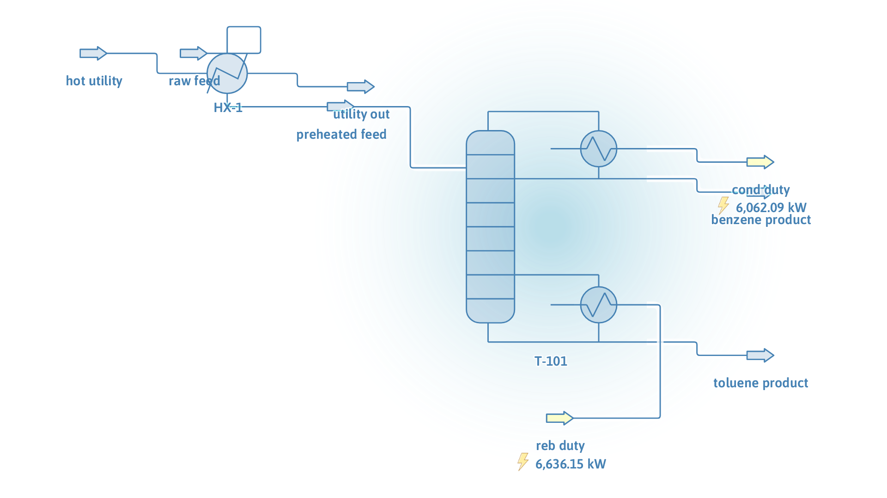

# Benzene/toluene distillation with feed preheat

**Category:** separation-processes
**Status:** community
**DWSIM version:** 10.2.0
**Language:** English
**Contributor:** Daniel Wagner Oliveira de Medeiros (@DanWBR)

## Summary

The classic binary separation, wired as a small train rather than a bare column: an equimolar benzene/toluene feed is preheated against hot water in a UA-rated exchanger and split in a 30-stage column at reflux ratio 3, delivering 99.99 mol% benzene overhead and 99.98 mol% toluene in the bottoms.

## Process description

100 mol/s of equimolar benzene/toluene at 300 K passes through the cold side of a heat exchanger rated at UA = 8000 W/K against 2 kg/s of hot water at 373 K, arriving at the column preheated to 331 K. The column has 30 stages, feed on stage 15, a total condenser with reflux ratio 3 and a bottoms molar flow specification of 50 mol/s.

## Feed and operating conditions

| Item | Value | Unit | Notes |
|---|---|---|---|
| Feed | 100 | mol/s | 50/50 Bz/Tol, 300 K, 1 atm |
| Hot utility | 2 kg/s water | | 373.15 K |
| Exchanger | UA = 8000 | W/K | CalcBothTemp_UA mode |
| Column | 30 stages, RR = 3 | | feed stage 15, B = 50 mol/s |

## Thermodynamics

- **Property package:** Peng-Robinson
- **Why this package:** benzene/toluene is a nearly ideal aromatic pair; an EOS treats both the column and the utility-water exchanger consistently.

## Tuning and convergence notes

- The spec pair "reflux ratio + bottoms molar flow" is the most forgiving combination for this column and converges from the default initial estimates.
- The column's internal mass-balance check derives its tolerance from the solver loop tolerances. At the default tight tolerances this case's converged profile trips the check by a hair (1.4e-4 vs 1e-4 relative on benzene); with loop tolerances at 1e-3 (still far tighter than the product purities need) it passes cleanly. `MaxIterations` = 200.

## Results

| Quantity | DWSIM | Notes |
|---|---|---|
| Molar balance F = D + B | 100 = 50 + 50 | mol/s |
| Distillate benzene | 99.99 mol% | |
| Bottoms toluene | 99.98 mol% | |
| Feed preheat | 300 → 332.0 K | from UA rating |
| Condenser / reboiler duty | 6062 / 6636 kW | |

## Files

- `benzene-toluene-distillation.dwxmz` — the DWSIM flowsheet.
- `benzene-toluene-distillation.png` — PFD screenshot.

This case is generated and verified by an automated test in the DWSIM repository (`tests/DWSIM.FluentAPI.Tests/Samples/BenzeneTolueneSample.cs`): built through the fluent API, solved, checked for the results above, saved, then reloaded and re-solved from the saved file.

## Confidentiality

All conditions are textbook values; no plant data was used.

## References

- Seader, Henley, Roper, *Separation Process Principles* — benzene/toluene as the canonical binary distillation example.
