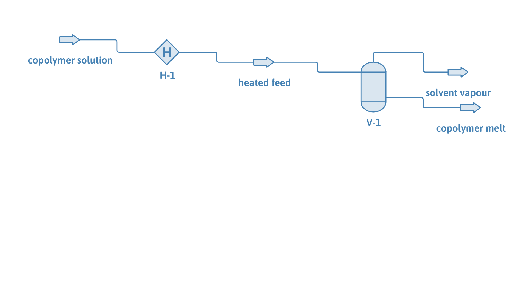

# Copolymer devolatilization: stripping solvent from an ethylene-propylene rubber solution

**Category:** separation-processes
**Status:** community
**DWSIM version:** 10.2.0
**Language:** English
**Contributor:** Daniel Wagner Oliveira de Medeiros (@DanWBR)

## Summary

A 30 wt% poly(ethylene-co-propylene) solution in n-pentane is stripped of its solvent under vacuum. Heated to 420 K and flashed at 0.15 bar, the n-pentane leaves as pure vapour and the copolymer stays as a 99.8 wt% melt. What makes this case different from a homopolymer devolatilization is the thermodynamics: PC-SAFT builds the copolymer from two *segment* types - ethylene and propylene - each reusing the parameters of its parent homopolymer, so a single equation of state describes a chain that is neither pure polyethylene nor pure polypropylene.

## Process description

An ethylene-propylene rubber (EPR/EPM, a random 50/50 ethylene-propylene copolymer, Mn = 50 000 g/mol) dissolved in n-pentane at 30 wt% enters a single-stage devolatilizer. A heater brings it to 420 K and drops the pressure to 0.15 bar; the flash vessel separates the recovered solvent vapour from the concentrated copolymer melt.

## Feed and operating conditions

| Item | Value | Unit | Notes |
|---|---|---|---|
| Feed | 1.0 | kg/s | 0.70 n-pentane / 0.30 copolymer (wt) |
| Copolymer | 50/50 ethylene/propylene, random | | Mn = 50 000 g/mol |
| Devolatilizer | 420 K, 0.15 bar | | heater + flash vessel |

## Thermodynamics

- **Property package:** PC-SAFT (with the segment-based copolymer model)
- **Why this package:** a copolymer's properties depend on its composition and monomer sequence, so it cannot be described by a single set of pure-component parameters. PC-SAFT's copolymer form (Gross, Spuhl, Tumakaka and Sadowski, 2003) runs the hard-chain and dispersion sums over the individual segment types: the ethylene segments carry the polyethylene parameters, the propylene segments the polypropylene parameters, and an internal ethylene-propylene binary corrects the bond between unlike segments. The result sits between the two homopolymers, which is what a real EPR rubber does.
- **Interaction parameters:** the built-in ethylene-propylene segment binary (kij = -0.009, Gross et al. 2003).

## Tuning and convergence notes

The most valuable part of this case.

- **Define the copolymer by its segments.** A copolymer is added as a user compound and then given a segment definition on the PC-SAFT package: the two parent-homopolymer CAS numbers with their mass fractions (here 50 % ethylene / 50 % propylene) and the sequence (random or alternating). PC-SAFT expands it into segments at solve time; the copolymer compound's own row in the parameter table is not used.
- **A copolymer's chemical potential is numerical, so route it to a plain vapour-liquid flash.** The fast analytical composition derivative that DWSIM uses to seed a liquid-liquid split is only valid for a single-segment compound; a copolymer takes its residual chemical potential from the segment model numerically. DWSIM therefore does not send a copolymer solution to the Gibbs-minimization liquid-split flash - it uses the vapour-liquid flash directly, which is what devolatilization needs and keeps the solve fast. (A copolymer *cloud point*, if you want one, has to be mapped with the convex-hull binodal, not a flowsheet flash.)
- **The non-volatile-polymer rules apply as for any polymer:** the copolymer is kept out of the vapour, and the vapour fraction is solved with the damped bracketed step that conserves the polymer mass. See the polystyrene devolatilization case for the details.

## Results

| Quantity | DWSIM | Notes |
|---|---|---|
| Mass balance F = vapour + melt | 1.000 = vapour + melt | closes |
| Solvent vapour purity | > 99.99 wt% n-pentane | no copolymer carryover |
| Copolymer in the vapour | < 1 ppm | non-volatile |
| Melt concentration | 99.8 wt% copolymer | devolatilized product |

## Files

- `copolymer-devolatilization.dwxmz` - the DWSIM flowsheet.
- `copolymer-devolatilization.png` - PFD screenshot.

This case is generated and verified by an automated test in the DWSIM repository (`tests/DWSIM.FluentAPI.Tests/Samples/CopolymerDevolatilizationSample.cs`): built through the fluent API, solved, checked for the results above, saved, then reloaded and re-solved from the saved file.

## Confidentiality

A generic ethylene-propylene copolymer devolatilization built from published PC-SAFT parameters; no proprietary data. Feed flow is normalized to 1 kg/s.

## References

- Gross, J.; Spuhl, O.; Tumakaka, F.; Sadowski, G. *Modeling Copolymer Systems Using the Perturbed-Chain SAFT Equation of State.* Ind. Eng. Chem. Res. 2003, 42, 1266.
- Tumakaka, F.; Gross, J.; Sadowski, G. *Modeling of polymer phase equilibria using Perturbed-Chain SAFT.* Fluid Phase Equilibria 2002, 194-197, 541.
