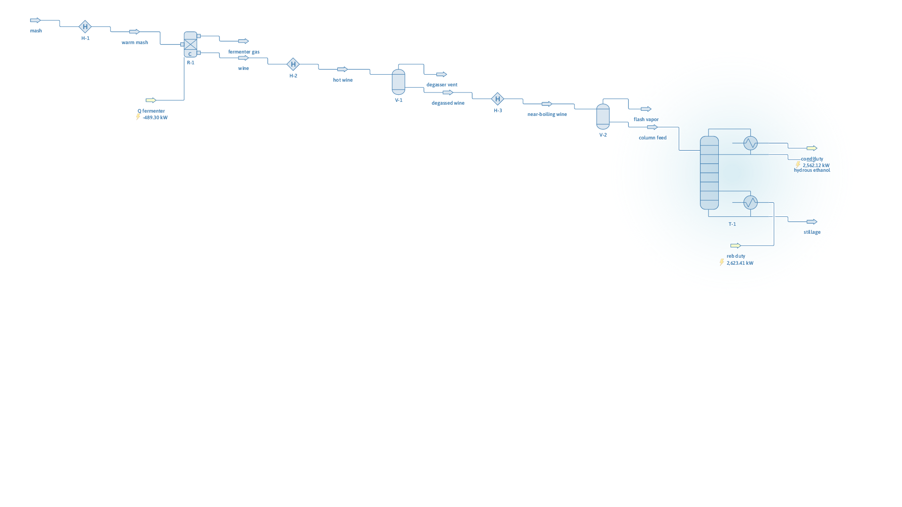

# Ethanol distillery: fermentation, degassing and distillation

**Category:** separation-processes
**Status:** community
**DWSIM version:** 10.2.0
**Language:** English
**Contributor:** Daniel Wagner Oliveira de Medeiros (@DanWBR)

## Summary

A wine-to-hydrous-ethanol train: a 10 % glucose mash ferments by the Gay-Lussac stoichiometry, the wine (5.3 wt% ethanol) is degassed of CO2 in two stages and distilled in a 25-stage column to a 79.3 mol% hydrous ethanol distillate — below the 89.4 mol% azeotrope — with stillage at 0.008 mol% ethanol. The convergence notes below document two traps this dilute column sets for the bubble-point solver.

## Process description

The mash (9 kg/s water + 1 kg/s glucose) is warmed to 35 °C and fermented in a conversion reactor: C6H12O6 → 2 C2H5OH + 2 CO2 at 100 % of the fermentable sugar. The CO2 leaves through the reactor's vapor port; the wine is heated to 358 K where a flash drum vents most of the dissolved CO2, then to just past its bubble point (370.8 K), where a second drum vents the last of the CO2 and hands the column a saturated liquid feed. The 25-stage column (feed on stage 12, reflux ratio 12) produces hydrous ethanol overhead and near-ethanol-free stillage.

## Feed and operating conditions

| Item | Value | Unit | Notes |
|---|---|---|---|
| Mash | 10 | kg/s | 9 water / 1 glucose (wt) |
| Fermenter | 308.15 K, 1 atm | | conversion reactor, isothermal |
| Wine | 5.28 | wt% EtOH | typical wine strength |
| Degasser drums | 358.15 K / 370.8 K | | two-stage CO2 removal |
| Column | 25 stages, RR = 12, 1 atm | | feed stage 12, bottoms-flow spec |

## Thermodynamics

- **Property package:** NRTL
- **Why this package:** the ethanol-water pair is strongly non-ideal with a minimum-boiling azeotrope at 89.4 mol% ethanol; NRTL with the built-in binaries reproduces it, and the case's checks require the distillate to stay below it.

## Tuning and convergence notes

The most valuable part of this case. Two things break the column if done naively:

- **Dissolved CO2.** Even 50 ppm of CO2 reaching the total condenser makes the Wang-Henke solver fail its component mass balance. The reactor's vapor port takes the bulk, but the wine keeps CO2 in solution; it takes the 358 K flash *and* the near-boiling flash to get the column feed clean.
- **Subcooled dilute feed.** With a ~2 mol% ethanol feed the temperature profile the bubble-point method iterates on is nearly flat. Fed subcooled (even 1.5 K below the bubble point) the solver "converges" to a point that violates the water balance by ~2 %. Fed as saturated liquid straight from the second flash drum, it converges cleanly. Hence the second drum right before the column.
- **Reflux ratio sets the stripping vapor.** With bottoms ≈ 420 mol/s of water and distillate ≈ 6 mol/s, the boilup is only D(R+1); at RR = 6 the stripping factor for ethanol is ≈ 1 and a quarter of the ethanol leaves in the stillage. RR = 12 lifts the boilup enough to recover > 99 % — dilute wine columns are energy-hungry, which is faithful to reality.
- The bottoms flow spec is computed from the ethanol that actually reaches the column (B = F − nEtOH/0.80) instead of hard-coded.

## Results

| Quantity | DWSIM | Notes |
|---|---|---|
| Fermenter mass balance | 10.000 = 10.000 kg/s | gas + wine |
| Wine ethanol | 5.28 wt% | |
| Distillate | 79.3 mol% EtOH | below the 89.4 mol% azeotrope |
| Stillage | 0.008 mol% EtOH | > 99 % recovery |
| Reboiler duty | 2623 kW | for 6.7 mol/s of ethanol product |

## Files

- `ethanol-distillery.dwxmz` — the DWSIM flowsheet.
- `ethanol-distillery.png` — PFD screenshot.

This case is generated and verified by an automated test in the DWSIM repository (`tests/DWSIM.FluentAPI.Tests/Samples/EthanolDistillerySample.cs`): built through the fluent API, solved, checked for the results above, saved, then reloaded and re-solved from the saved file.

## Confidentiality

All conditions are textbook values; no plant data was used.

## References

- Gmehling & Onken, *Vapor-Liquid Equilibrium Data Collection* (DECHEMA) — ethanol/water azeotrope.
