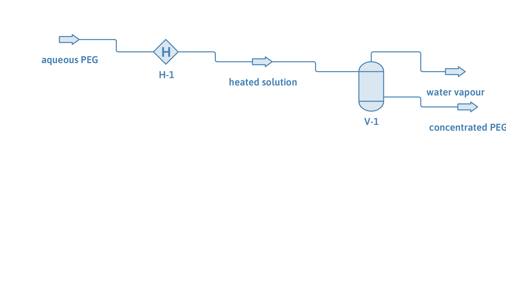

# PEG dewatering: concentrating an aqueous polymer solution by vacuum evaporation

**Category:** separation-processes
**Status:** community
**DWSIM version:** 10.2.0
**Language:** English
**Contributor:** Daniel Wagner Oliveira de Medeiros (@DanWBR)

## Summary

A 20 wt% poly(ethylene glycol) solution in water is concentrated by flashing off water under a mild vacuum. Heated to 355 K at 0.4 bar, the water leaves as pure vapour and the PEG is concentrated to about 70 wt%. What makes this case distinct from the other polymer separations is that PEG is a hydrogen-bonding polymer: it associates strongly with water, which makes water's activity in the solution steeply non-ideal and defeats an ordinary flash. It is modelled with PC-SAFT's association term and solved by the PC-SAFT flash.

## Process description

An aqueous PEG solution (80 wt% water, 20 wt% PEG, Mn = 10 000 g/mol) enters a single-stage evaporator. A heater brings it to 355 K and drops the pressure to 0.4 bar; the flash vessel separates the water vapour from the concentrated PEG solution.

## Feed and operating conditions

| Item | Value | Unit | Notes |
|---|---|---|---|
| Feed | 1.0 | kg/s | 0.80 water / 0.20 PEG (wt) |
| PEG Mn | 10 000 | g/mol | number-average molar mass |
| Evaporator | 355 K, 0.4 bar | | heater + flash vessel |

## Thermodynamics

- **Property package:** PC-SAFT (with association)
- **Why this package:** PEG is a non-volatile polymer *and* a hydrogen-bonding one. PC-SAFT treats it as a segment chain (m = (m/M).Mn) with an association scheme - here a four-site (4C) end-group model plus the ether oxygens along the chain that also accept hydrogen bonds. That association is what makes PEG hold water so tightly; a cubic equation or a plain activity model cannot capture it. The PEG is added from a user-compound JSON that ships with DWSIM.

## Tuning and convergence notes

The most valuable part of this case.

- **Water's K-value swings by orders of magnitude, and near unity.** Because PEG associates with water, water's activity in the solution is strongly and steeply non-ideal: its K-value runs from ~24 at trace polymer down through 1 to ~0.3 as the liquid becomes polymer-rich, crossing unity in a very narrow composition band. A flash that freezes the K-value each iteration (ordinary successive substitution) oscillates across that band and never converges. The PC-SAFT flash instead solves the vapour fraction directly, recomputing water's K at each trial composition - a one-dimensional, monotonic root find - which lands on the mass-conserving answer.
- **The polymer is kept in the liquid.** As with any polymer devolatilization, PEG is flagged non-volatile (zero vapour pressure, zero vapour-liquid K), so it is held entirely in the liquid and the whole polymer feed is conserved in the concentrate.
- **Run it under vacuum.** Water's activity in the PEG solution is suppressed by the hydrogen bonding, so a mild vacuum (here 0.4 bar) is what drives the evaporation at a moderate temperature.
- **Note on accuracy.** PC-SAFT with the shipped parameters reproduces the *qualitative* behaviour of aqueous PEG (strong, negative-deviation water binding and a non-volatile polymer); it is not tuned to reproduce a specific PEG-water vapour-liquid dataset quantitatively, so treat the exact water content of the concentrate as indicative.

## Results

| Quantity | DWSIM | Notes |
|---|---|---|
| Mass balance F = vapour + concentrate | 1.000 = vapour + concentrate | closes |
| Water vapour purity | > 99.99 wt% water | no polymer carryover |
| PEG in the vapour | < 1 ppm | non-volatile |
| Concentrate | ~70 wt% PEG | up from 20 wt% feed |

## Files

- `peg-dewatering.dwxmz` - the DWSIM flowsheet.
- `peg-dewatering.png` - PFD screenshot.

This case is generated and verified by an automated test in the DWSIM repository (`tests/DWSIM.FluentAPI.Tests/Samples/PegDewateringSample.cs`): built through the fluent API, solved, checked for the results above, saved, then reloaded and re-solved from the saved file.

## Confidentiality

A generic aqueous-polymer dewatering built from published PC-SAFT parameters; no proprietary data. Feed flow is normalized to 1 kg/s.

## References

- Gross, J.; Sadowski, G. *Application of the Perturbed-Chain SAFT Equation of State to Associating Systems.* Ind. Eng. Chem. Res. 2002, 41, 5510.
- Kontogeorgis, G. M.; Folas, G. K. *Thermodynamic Models for Industrial Applications*, Wiley, 2010 (PEG-water association, eq. 14.9).
