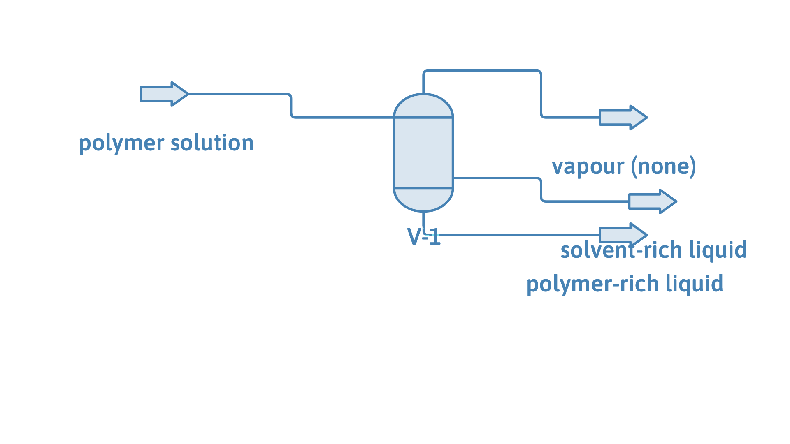

# Polymer solution cloud point: liquid-liquid demixing of polypropylene in n-pentane

**Category:** separation-processes
**Status:** community
**DWSIM version:** 10.2.0
**Language:** English
**Contributor:** Daniel Wagner Oliveira de Medeiros (@DanWBR)

## Summary

A 20 wt% polypropylene solution in n-pentane is a single liquid at low temperature but splits into two liquids - a polymer-rich phase and an almost pure solvent phase - as it is driven toward the solvent's critical region. At 460 K and 40 bar the solution is inside the miscibility gap, so a three-phase separator recovers a 27 wt% polymer concentrate and a nearly polymer-free n-pentane stream. This is the cloud-point (lower critical solution temperature) behaviour that PC-SAFT reproduces for polymer solutions, and the split comes out of an ordinary flash with no manual seeding.

## Process description

The feed (80 wt% n-pentane, 20 wt% polypropylene, Mn = 50 000 g/mol) is held at 460 K and 40 bar, conditions inside the polymer's miscibility gap. A three-phase separator splits the single feed into its two equilibrium liquids: a solvent-rich phase (essentially pure n-pentane) and a polymer-rich phase. No vapour forms - the pressure is well above the solvent's saturation - so both outlets are liquids.

## Feed and operating conditions

| Item | Value | Unit | Notes |
|---|---|---|---|
| Feed | 1.0 | kg/s | 0.80 n-pentane / 0.20 polypropylene (wt) |
| Polypropylene Mn | 50 000 | g/mol | number-average molar mass |
| Separator | 460 K, 40 bar | | inside the miscibility gap |

## Thermodynamics

- **Property package:** PC-SAFT (with association support)
- **Why this package:** polymer-solvent demixing is driven by the size asymmetry between a long chain and a small solvent and by the solvent approaching its critical point; a segment-based equation of state like PC-SAFT captures both, and it is the model Tumakaka et al. (2002) used to fit real polypropylene/n-pentane cloud curves. Cubic equations and activity models do not describe this LCST demixing. The polypropylene is added from a user-compound JSON that ships with DWSIM.
- **Interaction parameters:** the built-in polypropylene-n-pentane segment binary (kij = 0.0137, from Tumakaka et al.).

## Tuning and convergence notes

The most valuable part of this case.

- **Route the flash to the liquid-split path.** DWSIM's default flash decides whether to look for a second liquid from the *kinds* of compounds present (water plus hydrocarbons, alcohols plus hydrocarbons, and so on). A polymer solution matches none of those rules, so a PC-SAFT stream holding a polymer is sent to the liquid-split flash explicitly. That flash seeds the two phases from the equation of state's own spinodal, so you do not supply an initial guess.
- **The two liquids are close by mole, far apart by mass.** Because the polymer's mole fraction is tiny, the two phases differ by only about a thousandth in mole fraction even though one is nearly pure solvent and the other is a fifth polymer by mass. The phase-identity test that decides whether a split is real therefore compares *mass* fractions, not mole fractions - otherwise the two liquids look identical and get merged.
- **Stay below the solvent's critical temperature.** n-pentane's critical point is 469.7 K; the LCST demixing window sits just under it and above the solvent's saturation pressure (about 27 bar at 460 K). Pick a temperature a few kelvin below Tc and a pressure above saturation, and the gap is wide and easy to converge; too close to Tc and the phases merge.

## Results

| Quantity | DWSIM | Notes |
|---|---|---|
| Mass balance F = liquid1 + liquid2 | 1.000 = 0.249 + 0.751 kg/s | closes; no vapour |
| Polymer-rich phase | 27 wt% polypropylene | the concentrate |
| Solvent-rich phase | < 0.001 wt% polypropylene | nearly pure n-pentane |

The polymer-rich cloud composition (about 27 wt%) is consistent with the Tumakaka et al. (2002) Figure 5 tie lines for this system; that paper's cloud *pressures* at 5 wt% (47-73 bar over 177-197 C) are reproduced within 3 bar by the same parameters in the DWSIM validation suite.

## Files

- `polymer-cloud-point.dwxmz` - the DWSIM flowsheet.
- `polymer-cloud-point.png` - PFD screenshot.

This case is generated and verified by an automated test in the DWSIM repository (`tests/DWSIM.FluentAPI.Tests/Samples/PolymerCloudPointSample.cs`): built through the fluent API, solved, checked for the results above, saved, then reloaded and re-solved from the saved file.

## Confidentiality

A generic polymer-solution demixing example built from published PC-SAFT parameters; no proprietary data. Feed flow is normalized to 1 kg/s.

## References

- Tumakaka, F.; Gross, J.; Sadowski, G. *Modeling of polymer phase equilibria using Perturbed-Chain SAFT.* Fluid Phase Equilibria 2002, 194-197, 541.
- Gross, J.; Sadowski, G. *Perturbed-Chain SAFT: An Equation of State Based on a Perturbation Theory for Chain Molecules.* Ind. Eng. Chem. Res. 2001, 40, 1244.
