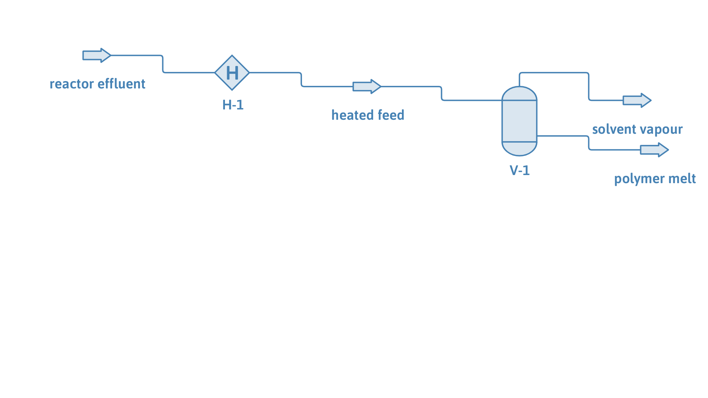

# Polystyrene devolatilization: flashing solvent off a polymer melt

**Category:** separation-processes
**Status:** community
**DWSIM version:** 10.2.0
**Language:** English
**Contributor:** Daniel Wagner Oliveira de Medeiros (@DanWBR)

## Summary

A 25 wt% polystyrene solution in ethylbenzene, the effluent of a solution-polymerization reactor, is stripped of its solvent under vacuum. Heated to 470 K and flashed at 0.15 bar, the ethylbenzene leaves as essentially pure vapour and the polystyrene stays behind as a 99 wt% melt, recovering better than 99 % of the solvent. This is a vapour-liquid flash with a non-volatile species, modelled with PC-SAFT, and it exercises a flash path that a mole-fraction-based algorithm gets wrong unless it is told the polymer cannot enter the vapour.

## Process description

A polymer solution (75 wt% ethylbenzene, 25 wt% polystyrene, Mn = 50 000 g/mol) enters a single-stage devolatilizer. A heater brings it to 470 K and drops the pressure to 0.15 bar (a light vacuum, typical of a first-stage devolatilizer). The flash vessel separates the two phases: the vapour is the recovered solvent, the liquid is the concentrated polymer melt.

## Feed and operating conditions

| Item | Value | Unit | Notes |
|---|---|---|---|
| Feed | 1.0 | kg/s | 0.75 ethylbenzene / 0.25 polystyrene (wt) |
| Polystyrene Mn | 50 000 | g/mol | number-average molar mass |
| Devolatilizer | 470 K, 0.15 bar | | heater + flash vessel |

## Thermodynamics

- **Property package:** PC-SAFT (with association support)
- **Why this package:** a polymer is not in any standard compound database and has no meaningful vapour pressure or critical constants. PC-SAFT treats the polystyrene as a chain of segments (its chain length scales with Mn through the segment-number-per-mass parameter), so the same equation of state describes the dilute solvent and the concentrated melt, and gives the solvent's activity in the polymer correctly. The polystyrene is added from a user-compound JSON that ships with DWSIM.
- **Interaction parameters:** the built-in ethylbenzene-polystyrene segment parameters; no fitted binary was needed for this case.

## Tuning and convergence notes

The most valuable part of this case. A vapour-liquid flash of a polymer solution has two traps that come from the polymer's enormous molar mass:

- **The polymer must be kept out of the vapour.** A high-Mn polymer has a tiny *mole* fraction (25 wt% polystyrene at Mn 50 000 is only 0.07 mol%), so a mole-fraction flash sees a stream that is 99.9 mol% solvent and is tempted to report it all as vapour. PC-SAFT flags the polymer non-volatile: its vapour pressure is zeroed and its vapour-liquid K-value pinned to zero, so it stays in the liquid.
- **The vapour fraction is pinned just below one.** Because almost every *mole* is solvent and almost all of it vaporizes, the physical vapour fraction sits at about 0.996 - a hair below the ceiling of `1 - (polymer mole fraction)`. The solvent's K-value also swings over orders of magnitude between a solvent-rich and a polymer-rich liquid, which makes the true two-phase point an unstable fixed point for a plain successive-substitution flash: it oscillates between "all liquid" and "all vapour". DWSIM solves the vapour fraction here by bracketing the (monotonic) Rachford-Rice function and damping the liquid fraction geometrically, which lands on the mass-conserving root. If you build this yourself, check the mass balance on the *melt*: the whole polymer feed must come out in the liquid.
- **Run it under vacuum.** At 1 atm the same solution flashes to a single liquid (the mixture bubble point of the concentrated solution is below atmospheric); the point of a devolatilizer is the vacuum, which is where the solvent actually strips.

## Results

| Quantity | DWSIM | Notes |
|---|---|---|
| Mass balance F = vapour + melt | 1.000 = 0.748 + 0.252 kg/s | closes |
| Solvent vapour purity | > 99.99 wt% ethylbenzene | no polymer carryover |
| Polystyrene in the vapour | < 1 ppm | non-volatile |
| Melt concentration | 99 wt% polystyrene | devolatilized product |
| Solvent recovered as vapour | 99.7 % | of the ethylbenzene fed |

## Files

- `polymer-devolatilization.dwxmz` - the DWSIM flowsheet.
- `polymer-devolatilization.png` - PFD screenshot.

This case is generated and verified by an automated test in the DWSIM repository (`tests/DWSIM.FluentAPI.Tests/Samples/PolymerDevolatilizationSample.cs`): built through the fluent API, solved, checked for the results above, saved, then reloaded and re-solved from the saved file.

## Confidentiality

A generic, textbook devolatilization; no proprietary data. Feed flow is normalized to 1 kg/s.

## References

- Gross, J.; Sadowski, G. *Perturbed-Chain SAFT: An Equation of State Based on a Perturbation Theory for Chain Molecules.* Ind. Eng. Chem. Res. 2001, 40, 1244.
- Tumakaka, F.; Gross, J.; Sadowski, G. *Modeling of polymer phase equilibria using Perturbed-Chain SAFT.* Fluid Phase Equilibria 2002, 194-197, 541.
